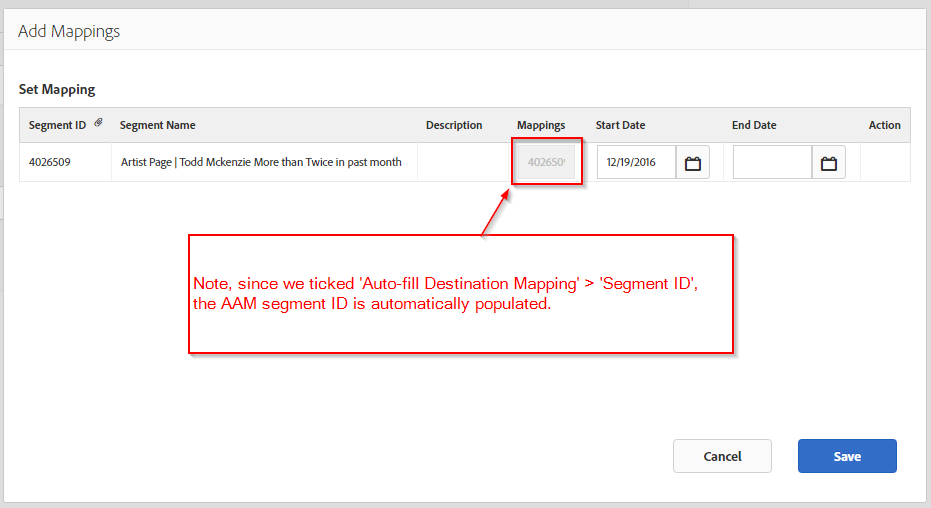

# 将AAM (Adobe Audience Manager)与LinkedIn集成

了解如何在AAM (Adobe Audience Manager)中创建基于LinkedIn URL的目标，用于推送AAM区段以进行在线广告定位。

## 描述 {#description}

### 环境

- Adobe Audience Manager (AAM)
- linkedIn

### 问题/症状

在AAM UI中创建的AAM区段可随时分配到LinkedIn目标。 请参阅 [创建区段](https://experienceleague.adobe.com/docs/audience-manager/user-guide/features/segments/segment-builder.html#create-segment)《Audience Manager用户指南》中的。

本文指导您如何创建基于LinkedIn URL的目标，以便将Adobe Audience Manager (AAM)区段推送到LinkedIn以进行在线广告定位。

<b>注意：</b> 此方法是一种解决方法，旨在支持您在LinkedIn平台中利用AAM区段。 任何LinkedIn UI更新或问题都必须咨询您各自的LinkedIn客户代表。

## 解决方法 {#resolution}

1. 在AAM中创建一个新的URL目标，名为 *linkedIn受众* 设置（请参阅下面附加的屏幕快照）：
   <b>基本信息 </b>

   - 环境：全部
   - 类型： URL
   - 勾选“自动填写目标映射”并选择“区段ID”

   <b>数据导出标签</b>
根据需要进行可选设置
   <b>配置</b>

   - URL类型：自定义URL
   - 勾选“序列化”
   - 基本URL：您将在此处输入LinkedIn像素

   <b>示例</b>

   - *基本URL：<b></b>[http://dc.ads.linkedin.com/collect/?pid=XXXXX&amp;fmt=gif&amp;noscript=1&amp;data=%ALIAS%](http://dc.ads.linkedin.com/collect/?pid=XXXXX&amp;amp;fmt=gif&amp;amp;noscript=1&amp;amp;data=%25ALIAS%25)<b>*
   - *安全URL：</b><b>[https://dc.ads.linkedin.com/collect/?pid=XXXXX&amp;fmt=gif&amp;noscript=1&amp;data=%ALIAS%](https://dc.ads.linkedin.com/collect/?pid=XXXXX&amp;amp;fmt=gif&amp;amp;noscript=1&amp;amp;data=%25ALIAS%25)</b>*

   <b>位置</b>

   - <b>*pid</b>* ：是LinkedIn合作伙伴ID
   - <b>*%ALIAS%</b>*：是一个AAM宏，将被动态替换为用户符合条件的AAM区段ID，以逗号“，”分隔

   <b>从页面触发的像素示例</b>
      <u><b><em><a href="https://dc.ads.linkedin.com/collect/?pid=51565&amp;fmt=gif&amp;noscript=1&amp;data=%25ALIAS%25" style="color:#0563c1; text-decoration:underline">https://dc.ads.linkedin.com/collect/?pid=51565&amp;fmt=gif&amp;noscript=1&amp;data=3401321,2993399,3263410</a></em></b></u>
      此示例显示属于三个区段或ID的用户：3401321、2993399和3263410。
      <b>URL目标配置示例</b>
   
2. 将适用的区段分配给新创建的目标。 使用AAM区段ID自动填充映射值。
输入结束日期（如果适用），或留空表示无结束日期。
   

现在，AAM将有选择地触发LinkedIn像素，动态填充区段ID，从而在LinkedIn中限定相应用户拥有Audience。
