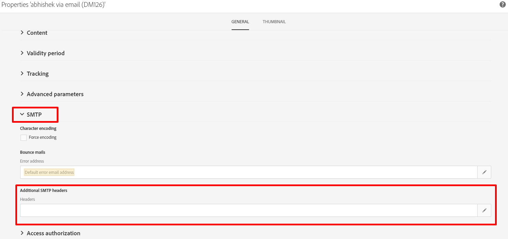

# 什么是List-Unsubscribe标头？ 如何在ACS中实现此功能？

## 描述

<b>什么是List-Unsubscribe标头？ </b>

List-Unsubscribe标头是可选的电子邮件标头，您可以将其添加到消息中。 订阅者可以查看取消订阅按钮，如果他们希望自动停止接收您的电子邮件，可单击该按钮。

List-Unsubscribe由 [!DNL Gmail], [!DNL Outlook.com]，等等。 它旨在通过为订阅者提供一种不同的方法来安全取消订阅，从而帮助减少投诉，而不会对您的发送信誉造成负面影响。

“列表取消订阅”标题很容易与订阅者用于取消订阅您电子邮件的其他两个选项混淆。

“List-Unsubscribe”选项不是：

- “垃圾信息”按钮：单击“垃圾邮件”或“垃圾邮件”按钮时，会触发投诉，这会对您的发送信誉造成负面影响。
- 电子邮件创作元素中的取消订阅链接：此链接通常位于HTML创作的页脚中，由您控制。 但是，如果已将“列表取消订阅”功能包含在标头中，则“列表取消订阅”功能由邮箱提供程序控制。

换句话说，将“列表取消订阅”选项视为订阅者从邮件列表中删除的第三种方法。 这个选项可以减少投诉，从而保护您的声誉。

RFC 2369中定义了“List-Unsubscribe”电子邮件标头。

## 分辨率

<b>如何在ACS中实现此功能？</b>

在ACS上，只能在投放模板中添加SMTP标头（不能直接在投放中添加）。

以下是要遵循的步骤：

1. 打开并编辑投放模板的属性

1. 单击SMTP部分并编辑 [!UICONTROL 标题] 从 [!UICONTROL 其他SMTP标头]

   

1. 添加以下命令行

   ```
   List-Unsubscribe: mailto:bounce@subdomain?subject=unsubscribe%=escape(context.mimeMessageId)
   ```

   电子邮件地址 *<b>bounce@subdomain</b>* 表示 <b>returnpath address</b>
