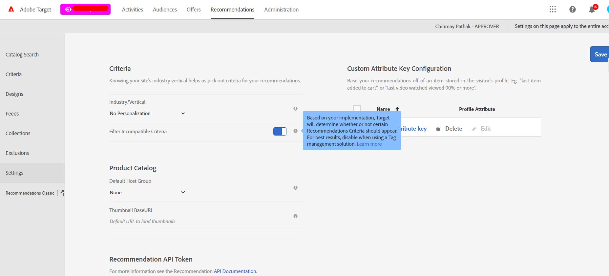

# 推荐是在创建活动时的筛选标准

## 描述 {#description}


<b>环境</b>
Adobe Target

<b>问题</b>
将特定标准应用于活动时，即使一切配置正确，也会收到警告消息：活动中的页面传递了标准所需的参数(`entity.id` 和 `entity.categoryId`)。

但是，在将所需的标准应用于活动时，仍会显示以下错误消息：


```
An entity.ategoryID is required for this criteria to work properly. Use it anyway?
```


<b>原因</b>
有时，活动生成器无法正确“获取”页面所标记的内容 `entity.id` 和 `entity.categoryId` 仍显示警告消息。


## 解决方法 {#resolution}


<b>解决方案</b>
您可以从以下推荐设置中关闭帐户级别的筛选：




使用此配置，活动内容投放没有任何限制。

此过滤仅用于创建活动，而不会以任何方式影响算法。
