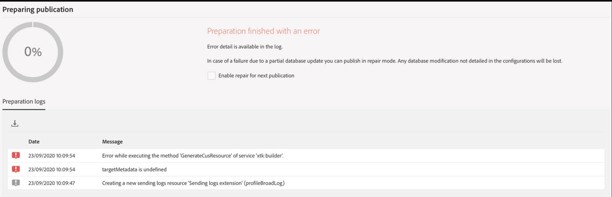

# [Campaign] 从暂存导入包时出错

## 描述 {#description}

<b>环境</b>
- 将包从暂存环境导入到生产环境
- 包中包含新的自定义资源

<b>症状</b>
- 导入失败，出现错误：准备已完成，但出现错误

## 解决方法 {#resolution}

解决/解决方法的步骤
- 在不发送日志实体的情况下重新导出包
- 导入新包

<b>原因</b>
- 无需导出发送日志实体。 将在发布用户档案时重新创建该配置文件。

