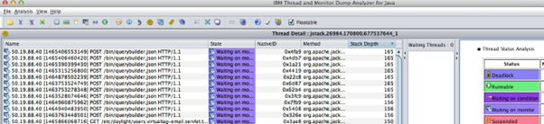

# AEM 线程转储分析

按照本文中详述的步骤和最佳实践，使用成功分析AEM Java线程转储 [IBM线程分析器](https://www.ibm.com/support/pages/ibm-thread-and-monitor-dump-analyzer-java-tmda) 工具。

## 描述 {#description}

<b>环境</b>

Adobe Experience Manager

<b>问题</b>

如何使用分析AEM Java线程转储 [IBM线程分析器](https://www.ibm.com/support/pages/ibm-thread-and-monitor-dump-analyzer-java-tmda) 工具？

## 解决方法 {#resolution}

1. 下载并安装 [IBM线程分析器](https://www.ibm.com/support/pages/ibm-thread-and-monitor-dump-analyzer-java-tmda) (我们将其简称为IBM TDA)。
2. 从遇到性能问题的 AEM 实例中捕获[线程转储](https://helpx.adobe.com/experience-manager/kb/thread-dumps-collection-analysis.html)。
3. 在 IBM TDA 中打开线程转储。
4. 要查看线程转储的详细信息，请选择列表中的文件，然后单击 <b>线程详细信息</b> 按钮。

   
5. 排序方式 <b>栈栈深度</b> 最长的栈栈在顶端。

   
6. 查看堆栈深度为 10 行或更长的线程。  这些通常是人们最感兴趣的线程。

   在感兴趣的线程上做笔记。
7. 按线程排序 <b>状态</b>.
8. 向下滚动到 <b>可运行</b> 线程。 可运行线程是在进行线程转储时大量占用 CPU 时间的线程。

   *注：在查看 <b>可运行</b> 线程中，您可以忽略列在 <b>可以忽略的Threads</b> 部分。*

9. 查找属于应用程序一部分的可运行线程，例如，后台作业线程或请求线程(请求线程的名称如下 —  *127.0.0.1 `[` 1347028187737`]`  GET/content/sites/global/en/sitemap.static-delivery.httpd.html HTTP/1.1*)。

   找到后，请一一单击这些线程。
10. 对于每个请求线程，您可以通过查看线程名称中的时间戳来了解用户的浏览器何时向服务器发出请求。

   例如，在以上线程的名称中，时间戳（以毫秒为单位的unix epoch格式）为 *1347028187737*.

   我们可以使用将该epoch数字转换为日期/时间 [www.epochconverter.com](https://www.epochconverter.com/).

   每个线程转储都显示了它被占用时的日期和时间。

   您可以通过请求时间和线程转储时间之间的时间差来查看请求活动的时间。
11. 查看请求线程后，滚动浏览另一个 <b>可运行</b> 线程。

   找到感兴趣的可运行线程后，请查看中间面板， <b>等待线程</b>.

   此处列出的Threads正在等待所选线程释放监视器。

   如果您没有看到任何等待线程，那么您选择的线程可能仍然是的所有者。 [锁定](https://docs.oracle.com/javase/1.5.0/docs/api/java/util/concurrent/locks/Lock.html) (请参阅实现类 [锁定](https://docs.oracle.com/javase/1.5.0/docs/api/java/util/concurrent/locks/Lock.html) 以了解详情)。

   例如，使用 [ReentrantReadWriteLock](https://docs.oracle.com/javase/1.5.0/docs/api/java/util/concurrent/locks/ReentrantReadWriteLock.html) 您无法分辨哪个线程是锁的持有者，因为锁在内部实施了多个监视器。

   因此，您可能必须查看源代码，将其与可能是锁持有者的线程匹配。
12. 如果某个线程有许多其他线程正在等待的锁或监测器，那么请检查其余的线程转储，看看是否能找到有相同问题的其他线程。

   查看其他转储中是否仍然存在相同的线程(在IBM TDA中，您可以选择多个线程转储，然后单击 <b>比较Threads</b> 按钮以查看多个线程转储中的线程状态。

   
13. 请参阅 <b>收集器服务</b> 在下面的屏幕截图中：

   
14. 在此视图中，您可以跨多个线程转储查看线程，看看它是否是长时间运行的线程。

   基本上，如果线程在 <b>可运行</b> 跨多个转储的状态并且具有长栈栈，那么这通常意味着它是一个长时间运行的线程。
15. 如果您没有发现什么，请参阅 <b>可运行</b> 线程，然后返回线程列表，选择一个线程转储，然后单击 <b>监视器详细信息</b> 按钮。

   IBM TDA将打开一个窗口，显示拥有线程及其等待线程的监视器的树视图。

   *注意：它可能会显示一些线程池线程，如servlet引擎线程池监视器，可以忽略空闲线程。*

   您通常可以分辨某个线程是否是空闲线程池线程，因为大多数时候它们只有10个或更少的栈栈行。

   

<u><b>线程级别CPU利用率（仅限Linux平台）</b></u><b>：</b>

1. 如果您捕获 `top -H -b -n1 -p <javapid>` 除了线程转储之外，您还可以交叉引用线程级别的CPU利用率。

   打开顶部输出并获取正在使用CPU的线程的进程ID。

   将进程ID转换为十六进制，然后在相应的线程转储文件中搜索该十六进制值。

   ID应与 <b>nid</b> 其中一个线程。
2. 如果使用最多CPU的匹配线程是 <b>VM线程</b> 或任何 <b>GC</b> 线程可能存在内存问题。

   对更多线程转储和最高输出重复相同的练习，如果这些线程的模式占用了CPU时间，则说明存在内存问题。
3. 如果您已确认内存问题，则请在下次出现问题时捕获栈转储。

   查看此 [分析内存问题文章](https://experienceleague.adobe.com/docs/experience-cloud-kcs/kbarticles/KA-17482.html?lang=en) 以了解有关捕获和分析栈转储的更多详细信息。

<b><u>可以忽略的Threads</u>：</b>

- VM 线程：这是一个 VM 系统线程。
- 以 GC 任务线程开头的线程：这些是垃圾收集线程。
- 名称类似于的Threads `- [ 1347028691218]  in code at java.net.PlainSocketImpl.socketAccept(Native Method)`：这些线程来自servlet引擎的线程池，等待新连接。
