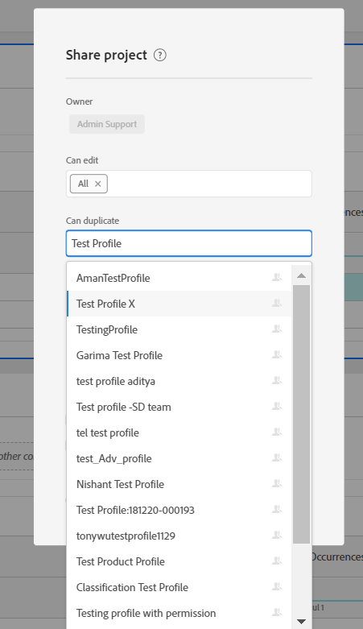

# 在共享工作区项目时使产品配置文件可用的先决条件

## 描述 {#description}

<b>环境</b>
- Customer Journey Analytics
- Analytics

<b>问题/症状</b>
与“X”用户共享工作区项目时，产品配置文件显示“X”在下拉菜单中可能不可用。

## 解决方法 {#resolution}

要使任何产品配置文件在共享工作区项目时在下拉列表中可用，它必须具有/已在Admin Console中具有与其关联的任何Analytics权限。 将任何随机权限添加到产品配置文件“X”后，用户应在共享任何Workspace项目时开始从下拉列表中看到该权限。

在上例中 — 产品配置文件“测试配置文件X”在新建时没有权限在下拉选项中可用。 但是，当我们添加权限时，该功能即可用。

<b>注意：</b> 如果分配给产品配置文件“X”的所有权限在Admin Console中被撤销，则产品配置文件“X”将 <b>静态 </b>在下拉列表中继续提供共享项目。

     
