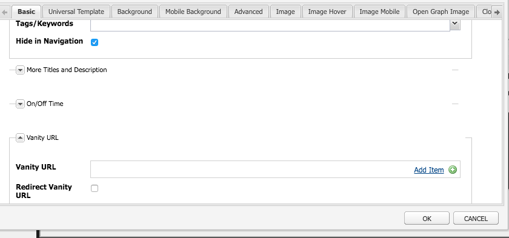

# Dispatcher虚URL

## 描述 {#description}

<b>环境</b>
Experience Manager

<b>问题/症状</b>
本文档将帮助您了解AEM如何处理虚URL，以及其他一些使用重写规则映射更靠近交付边缘的内容的技术

什么是虚URL

如果您的内容位于合理的文件夹结构中，它并不总是位于易于引用的URL中。  虚URL类似于快捷方式。  引用实际内容所在位置的较短或唯一URL。

示例： <b>/aboutus</b> 指向 <b>/content/we-retail/us/en/about-us.html</b>

AEM作者可以选择在AEM中为某段内容设置虚URL属性并将其发布。

要使用此功能，您必须调整调度程序过滤器，以允许虚URL通过。  但这会使以作者设置这些虚页面条目所需的速率调整调度程序配置文件变得不合理。

因此，调度程序模块具有自动允许内容树中列出的任何虚值的功能。

## 解决方法 {#resolution}

工作原理

创作虚URL

作者在AEM中访问页面，然后访问页面属性，并在虚URL部分添加条目。
保存更改并激活页面后，会将该虚值分配到此页面。
触控UI：

经典内容查找器：

注意：请注意，此对话框很容易受名称空间问题的影响。
虚条目对于所有页面都是全局的，这只是您必须为其规划解决方法的简短命令之一。 我们稍后会解释其中的几个。
资源解析/映射

每个虚条目都是用于内部重定向的sling映射条目。
通过访问AEM实例Felix控制台(<b>/system/console/jcrresolver</b>)以下是虚条目创建的映射条目的屏幕截图：

在上例中，当我们要求AEM实例访问/aboutus时，它将解析为/content/we-retail/us/en/about-us.html

Dispatcher自动允许过滤器

处于安全状态的Dispatcher会过滤掉路径/上通过Dispatcher的请求，因为这是JCR树的根目录。
请务必确保发布者仅允许来自/content和其他安全路径的内容，而不允许/system等路径的内容。下面是/的基本文件夹中的问题和虚URL，那么我们如何在保持安全的同时允许他们访问发布者？
简单的调度程序具有自动过滤器允许机制，您必须安装AEM包，然后将Dispatcher配置为指向该包页面。
[https://experience.adobe.com/#/downloads/content/software-distribution/en/aem.html?package=/content/software-distribution/en/details.html/content/dam/aem/public/adobe/packages/granite/vanityurls-components](https://experience.adobe.com/#/downloads/content/software-distribution/en/aem.html?package=/content/software-distribution/en/details.html/content/dam/aem/public/adobe/packages/granite/vanityurls-components)
Dispatcher在其场文件中有一个配置部分：

<b>/vanity_urls {</b><b> </b><b>    </b><b> </b><b>/url &quot;/libs/granite/dispatcher/content/vanityUrls.html&quot;</b><b> </b><b>    </b><b> </b><b>/file &quot;/tmp/vanity_urls&quot;</b><b> </b><b>    </b><b> </b><b>/delay 300</b><b> </b><b>}</b>

 
此配置会告知Dispatcher每300秒从它的AEM实例中获取此URL，以获取我们希望允许通过的项目列表。
它将响应的缓存存储在/file参数中，因此在此示例中/tmp/vanity_urls如果您以URI访问AEM实例，您将看到其获取的内容：

这是一个非常简单的列表。

将规则重写为虚规则

为什么要提到使用重写规则，而不使用如上所述的内置到AEM中的默认机制？
简单来说，命名空间问题、性能和可以更好地处理的更高级别逻辑。
让我们再看一下虚条目的一个示例 */aboutus* 到其内容 */content/we-retail/us/en/about-us.html* 使用Apache的mod_rewrite模块完成此任务。

<b>RewriteRule /aboutus /content/we-retail/us/en/about-us.html PT，L，NC</b>

此规则将查找虚/aboutus，并从带有PT标志（通过）的渲染器中获取完整路径。
它还将停止处理所有其他规则L标记（最后），这意味着它不必遍历大型规则列表，如JCR解析必须执行的规则列表。
同时不必代理请求并等待AEM发布者响应此方法的这两个元素，因此提高了其性能。
此处锦上添花的是NC标志（不区分大小写），这意味着如果客户使用/AboutUs而不是/aboutus替换URI，它仍然有效，并允许提取正确的页面。
要创建重写规则以执行此操作，您需要在调度程序上创建一个配置文件(示例：/etc/httpd/conf.d/rewrites/examplevanity_rewrite.rules)，并将其包含在.vhost文件中，该文件处理需要应用这些虚URL的域。
以下是include inside的示例代码片段

/etc/httpd/conf.d/enabled_vhosts/we-retail.vhost VirtualHost \*：80 ServerName weretail.com ServerAlias www.weretail.com ........ 截取........     IfModule mod_rewrite.c RewriteEngine on LogLevel warn rewrite：info Include /etc/httpd/conf.d/rewrites/examplevanity_rewrite.rules / IfModule ........ 截取......../VirtualHost

何种方法和何处

使用AEM控制虚条目具有以下优点

- 作者可以动态创建它们
- 它们与内容共存，并可与内容一起打包

使用mod_rewrite控制虚条目具有以下优点

- 解析内容的速度更快
- 更接近最终用户内容请求的边缘
- 更多可扩展性和选项，用于控制如何在其他条件上映射内容
- 可以不区分大小写

请同时使用这两种方法，但以下是有关何时使用哪种方法的建议和标准：

- 如果虚值是临时的，并且规划的流量级别较低，则使用AEM内置功能
- 如果虚值是不经常更改且频繁使用的固定端点，则使用mod_rewrite规则。
- 如果虚命名空间（例如：/aboutus）必须对同一AEM实例上的多个品牌重用，则使用重写规则。

注意：如果要使用AEM虚功能并避免命名空间，可以制定命名约定。  使用嵌套如/brand1/aboutus、brand2/aboutus、brand3/aboutus的虚URL
