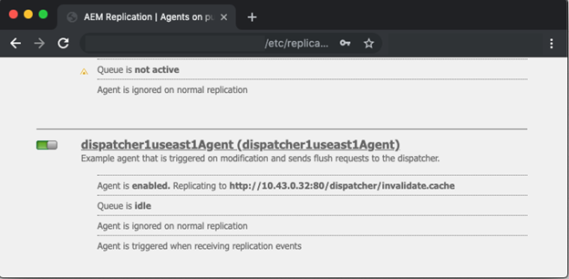
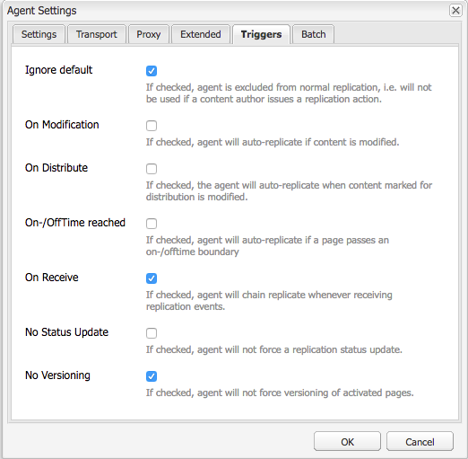

# AdobeManaged Services Dispatcher刷新

探索缓存刷新机制和内容激活工作流的细微差别，这对于维护系统效率和数据完整性至关重要。

## 描述 {#description}

### <b>环境</b>

Experience Manager

### <b>问题/症状</b>

本文档将提供刷新的发生方式，并说明执行缓存刷新和失效的机制。
  工作原理 
<b>操作顺序</b>

对典型的工作流的最佳诠释是：当内容作者激活页面时，发布者接收到新内容时，会向调度程序触发刷新请求，如下图所示：

此事件链接强调的是，我们仅在项目为新项目或发生更改时刷新项目。  这样可以确保在清除缓存之前，发布者已经接收到内容，从而避免在发布者能够提取更改之前发生刷新的竞争情况。

### <b>复制代理</b>

对于作者，有一个配置为指向发布者的复制代理，当激活某些内容时，它会触发将文件及其所有依赖项发送到发布者。

当发布者收到文件时，会将复制代理配置为指向接收事件触发的Dispatcher。  然后，它将序列化刷新请求并将其发布到调度程序。

#### 创作复制代理

以下是配置的标准复制代理屏幕截图示例：

创作实例上通常为其复制内容的每个发布者配置1或2个复制代理。

第一个是将内容激活推送到的标准复制代理。

第二个是反向代理。  这是可选操作，设置为检查每个发布者的发件箱，以查看是否有新内容可作为反向复制活动提取到作者中

#### 发布者复制代理

以下是配置的标准刷新复制代理屏幕截图示例：

#### DISPATCHER刷新复制接收虚拟主机

调度程序模块会查找特定的标头，以了解POST请求何时可以传递给AEM渲染，或者是否将其序列化为刷新请求，以及是否需要由调度程序处理程序本身进行处理。  以下是显示这些值的配置页面屏幕截图：

默认设置页面显示 <b>序列化类型</b> 作为 *Dispatcher刷新* 并设置错误级别：

在传输选项卡上，您可以看到URI设置为指向将接收刷新请求的调度程序的IP地址。  路径/dispatcher/invalidate.cache并不是模块确定其是否为刷新的方式，它只是您可以在访问日志中看到的明显端点，用来确定它是刷新请求。  在“扩展”选项卡中，我们将检查所有内容以确定其是否是调度程序模块的刷新请求。

刷新请求的HTTP方法只是带有一些特殊请求标头的GET请求：

- CQ-Action

  此标头根据请求来使用AEM变量，其值通常为 *激活或删除* 

- CQ-Handle此标头根据请求来使用AEM变量，例如，该值通常是刷新项目的完整路径 */content/dam/logo.jpg*

- CQ-Path

  此标头根据请求来使用AEM变量，例如，值通常是刷新项目的完整路径 */content/dam*

- Host

  这是欺骗Host Header以定位特定 `<` 虚拟主机`>`  在Dispatcher Apache Web Server上配置的服务器(/etc/httpd/conf.d/enabled_vhosts/aem_flush.vhost)。  这是与aem_flush.vhost文件中的条目匹配的编码值。 *服务器名称* 或 *ServerAlias*

  

  在“触发器”选项卡中，我们将记下我们使用的切换触发器以及触发器是什么

- <b>忽略默认值</b>

  启用该选项，页面激活时就不会触发复制代理。  就是说，当作者实例对页面进行更改时会触发刷新。  由于这是发布者，因此我们不想触发此类事件。

- <b>接收时</b>

  收到新文件后，我们要触发刷新。  因此，当作者向我们发送更新的文件时，我们将触发并向调度程序发送刷新请求。

- <b>无版本控制</b>

  选中此项以避免发布者因为接收到新文件而生成新版本。  我们将仅替换已有的文件，并依靠作者而非发布者来跟踪版本。

现在，我们看一下curl命令形式的典型刷新请求是什么样的
          

| `$ curl \``-H``"CQ-Action: Activate"` `\``-H``"CQ-Handle: /content/dam/logo.jpg"` `\``-H``"CQ-Path: /content/dam/"` `\``-H``"Content-Length: 0"` `\``-H``"Content-Type: application/octect-stream"` `\``-H``"Host: flush"` `\``http:``//10``.43.0.32:80``/dispatcher/invalidate``.cache` |
| --- |

此刷新示例将通过更新该目录中的.stat文件来刷新/content/dam路径。

### .stat文件

冲洗机制本质上很简单，我们要说明 <b>.stat</b> 在文档根目录中生成的文件，其中创建了缓存文件。

在.vhost和_farm.any文件中，我们配置文档根指令，以指定当收到最终用户的请求时，缓存的位置以及文件的存储/服务位置。

如果您要在调度程序服务器上运行以下命令，则会开始找到.stat文件

| 1 | `$``find` `/mnt/var/www/html/` `-``type` `f -name``".stat"` |
| --- | --- |

#### 下图显示了当缓存中有项目，并且调度程序模块发送并处理了刷新请求时，此文件结构的外观：

#### 

 stat文件级别

请注意，每个目录中都有一个.stat文件。  这是表示已发生刷新的指示器。  在上面的示例中， <b>stat文件级别</b> 设置已设置为 <b>3</b> 在相应的场配置文件中。

stat文件级别设置指示模块将遍历并更新.stat文件的文件夹深度。  .stat文件为空，它只不过是带有日期戳的文件名，甚至可以手动创建，但可以在调度程序服务器的命令行上运行touch命令。

如果stat文件级别设置设置过高，则每个刷新请求都将遍历接触stat文件的目录树。  这可能会严重影响大型缓存树的性能，并可能会影响Dispatcher的整体性能。

将此文件级别设置过低会导致刷新请求清除的内容超出预期。  这进而会导致更频繁的缓存流失，使缓存中提供的请求减少，并导致性能问题。

注释：

将statfilelevel设置为合理的级别。  查看您的文件夹结构，确保设置为允许简洁的刷新而不必遍历太多目录。   在系统性能测试期间对其进行测试并确保它符合您的需求。

一个支持语言的站点就是一个很好的示例。  典型的内容树具有以下目录

/content/brand1/en/us/

在此示例中，使用stat文件级别设置4。  这将确保您何时刷新位于下的内容 <b>us</b> 不会导致语言文件夹也刷新的文件夹。

#### STAT文件时间戳握手

当对内容的请求进入时相同的例程

1. 会比较.stat文件的时间戳与请求文件的时间戳
2. 如果.stat文件比请求的文件新，它将删除缓存的内容并从AEM中获取新内容并缓存该内容。  然后提供内容
3. 如果.stat文件的时间戳比请求的文件的时间戳旧，则表明该文件已刷新，可以提供内容。

#### 缓存握手 — 示例1

在上述示例中，有一个/content/index.html内容请求

index.html文件的时间是2019-11-01 @ 6:21PM

最近的.stat文件的时间是2019-11-01 @ 12:22PM

了解我们上述内容后，您可以发现index文件比.stat文件新，因此会将缓存中的文件提供给发出请求的最终用户

#### 缓存握手 — 示例2

在上述示例中，有一个/content/dam/logo.jpg内容请求

logo.jpg文件的时间是2019-10-31 @ 1:13PM

最近的.stat文件的时间是2019-11-01 @ 12:22PM

如本示例所示，该文件比.stat文件旧，所以该文件将会被删除，并从AEM中拉取刷新内容来替换它，然后提供给发出请求的最终用户。
    场文件设置    
文档位于此处，以了解完整的配置选项集： [https://docs.adobe.com/content/help/en/experience-manager-dispatcher/using/configuring/dispatcher-configuration.html#configuring-dispatcher_configuring-the-dispatcher-cache-cache](https://docs.adobe.com/content/help/en/experience-manager-dispatcher/using/configuring/dispatcher-configuration.html#configuring-dispatcher_configuring-the-dispatcher-cache-cache)

我们将重点介绍其中一些与缓存刷新相关的设置

### 文档根目录

此配置条目位于场文件的以下部分：
          

| `/myfarm {``    ``/cache {``        ``/docroot` |
| --- |

您可以指定希望Dispatcher填充并管理的目录作为缓存目录。

注释：

此目录应该与Web服务器配置使用的域的Apache文档根目录设置匹配。

出于多种原因，不适合将每个场的嵌套docroot文件夹放置在Apache文档根目录的子文件夹下中。

### stat文件级别

此配置条目位于场文件的以下部分：
          

| `/myfarm {``    ``/cache {``        ``/statfileslevel` |
| --- |

        
此设置确定在收到刷新请求时需要生成多深的.stat文件。

刷新/content/dam/brand1/en/us/logo.jpg时，将/statfileslevel设置为以下数字（文档根目录为/var/www/html/）将产生以下结果

- 0 — 将创建以下stat文件
   - /var/www/html/.stat
- 1 — 将创建以下stat文件
   - /var/www/html/.stat
   - /var/www/html/content/.stat
- 2 — 将创建以下stat文件
   - /var/www/html/.stat
   - /var/www/html/content/.stat
   - /var/www/html/content/dam/.stat
- 3 — 将创建以下stat文件

   - /var/www/html/.stat
   - /var/www/html/content/.stat
   - /var/www/html/content/dam/.stat
   - /var/www/html/content/dam/brand1/.stat
- 4 — 将创建以下stat文件

   - /var/www/html/.stat
   - /var/www/html/content/.stat
   - /var/www/html/content/dam/.stat
   - /var/www/html/content/dam/brand1/.stat
   - /var/www/html/content/dam/brand1/en/.stat
- 5 — 将创建以下stat文件

   - /var/www/html/.stat
   - /var/www/html/content/.stat
   - /var/www/html/content/dam/.stat
   - /var/www/html/content/dam/brand1/.stat
   - /var/www/html/content/damn/brand1/en/.stat
   - /var/www/html/content/damn/brand1/en/us/.stat

注释：

请记住，发生时间戳握手时，会查找最近的.stat文件。

.stat文件级别为0且stat文件仅位于/var/www/html/.stat中，表示/var/www/html/content/dam/brand1/en/us/下的内容将查找最近的.stat文件，并最多遍历5个文件夹以查找级别为0且唯一的.stat文件，并比较其日期。  这意味着如此高级别的刷新将最终使所有缓存项目失效。

### 允许失效

此配置条目位于场文件的以下部分：
          

| `/myfarm {``    ``/cache {``        ``/allowedClients {` |
| --- |

在此配置内部，放置了允许发送刷新请求的IP地址列表。  如果调度程序收到了刷新请求，则该请求必须来自受信任的IP。  如果您配置错误或从不受信任的IP地址发送了刷新请求，您将在日志文件中看到以下错误：
          

| `[ Mon Nov 11 22:43:05 2019]  [ W]  [ pid 3079 (tid 139859875088128)]  Flushing rejected from 10.43.0.57` |
| --- |

### 失效规则

此配置条目位于场文件的以下部分：
          

| `/myfarm {``    ``/cache {``        ``/invalidate {` |
| --- |

这些规则通常指示允许通过刷新请求使哪些文件失效。

为了避免重要文件因页面激活而失效，您可以设置规则以指定哪些文件可以失效以及哪些文件必须手动失效。  以下是仅允许html文件失效的配置示例：
          

| `/invalidate {``   ``/0000 { /glob "*" /type "deny" }``   ``/0001 { /glob "*.html" /type "allow" }``}` |
| --- |

        

## 解决方法 {#resolution}

测试/故障排除 
当您激活页面并获得成功激活页面的绿灯时，您应该希望激活的内容也从缓存中清除。

你刷新页面，看到旧内容，就会看到绿灯。

下面我们按照一些手动步骤来完成刷新过程，以了解哪里可能出现问题。  在发布者shell中使用curl运行以下刷新请求：

   

| `$ curl -H``"CQ-Action: Activate"` `\``-H``"CQ-Handle: /content/<PATH TO ITEM TO FLUSH>"` `\``-H``"CQ-Path: /content/<PATH TO ITEM TO FLUSH>"` `\``-H``"Content-Length: 0"` `-H``"Content-Type: application/octet-stream"` `\``-H``"Host: flush"` `\``http:``//``<DISPATCHER IP ADDRESS>``/dispatcher/invalidate``.cache` |
| --- |

测试刷新请求示例
   

| `$ curl -H``"CQ-Action: Activate"` `\``-H``"CQ-Handle: /content/customer/en-us"` `\``-H``"CQ-Path: /content/customer/en-us"` `\``-H``"Content-Length: 0"` `-H``"Content-Type: application/octet-stream"` `\``-H``"Host: flush"` `\``http:``//169``.254.196.222``/dispatcher/invalidate``.cache` |
| --- |

将请求命令发送给调度程序后，您将需要在日志中查看中已完成的操作以及对.stat文件执行的操作。  跟踪日志文件，您应该会看到以下条目，以确认刷新请求已到达调度程序模块
   

| `[ Wed Nov 13 16:54:12 2019]  [ I]  [ pid 19173:tid 140542721578752]  Activation detected: action=Activate [ /content/dam/logo.jpg]``[ Wed Nov 13 16:54:12 2019]  [ I]  [ pid 19173:tid 140542721578752]  Touched /mnt/var/www/html/.stat``[ Wed Nov 13 16:54:12 2019]  [ I]  [ pid 19173:tid 140542721578752]  Touched /mnt/var/www/html/content/.stat``[ Wed Nov 13 16:54:12 2019]  [ I]  [ pid 19173:tid 140542721578752]  Touched /mnt/var/www/html/content/dam/.stat``[ Wed Nov 13 16:54:12 2019]  [ I]  [ pid 19173:tid 140542721578752]  "GET /dispatcher/invalidate.cache" 200 purge [ publishfarm/-]  0ms` |
| --- |

模块已提取并确认刷新请求后，我们需要查看它对.stat文件有何影响。  运行以下命令，并在发出另一个刷新时观察时间戳更新：
   

| `$``watch` `-n 3``"find /mnt/var/www/html/ -type f -name "``.stat``" | xargs ls -la $1"` |
| --- |

从命令输出中可以看到当前.stat文件的时间戳
   

| `-rw-r--r--. 1 apache apache 0 Nov 13 16:54``/mnt/var/www/html/content/dam/``.stat``-rw-r--r--. 1 apache apache 0 Nov 13 16:54``/mnt/var/www/html/content/``.stat``-rw-r--r--. 1 apache apache 0 Nov 13 16:54``/mnt/var/www/html/``.stat` |
| --- |

现在，如果我们再次运行刷新，您将看到时间戳更新
   

| `-rw-r--r--. 1 apache apache 0 Nov 13 17:17``/mnt/var/www/html/content/dam/``.stat``-rw-r--r--. 1 apache apache 0 Nov 13 17:17``/mnt/var/www/html/content/``.stat``-rw-r--r--. 1 apache apache 0 Nov 13 17:17``/mnt/var/www/html/``.stat` |
| --- |

让我们将内容时间戳与.stat文件时间戳进行比较
   

| `$ stat``/mnt/var/www/html/content/customer/en-us/``.stat``  ``File: `.stat&#39;``  ``大小： 0个块： 0 IO块： 4096常规空``file``设备：ca90h``/51856d`    `Inode: 17154125    Links: 1``访问： (0644``/-rw-r--r--``) Uid： ( 48/ apache) Gid： ( 48/ apache)``Access: 2019-11-13 16:22:31.000000000 -0400``修改：2019-11-13 16:22:31.000000000 -0400``Change: 2019-11-13 16:22:31.000000000 -0400`   `$ stat``/mnt/var/www/html/content/customer/en-us/logo``.jpg``文件： `logo.jpg'``  ``Size: 15856           Blocks: 32          IO Block: 4096   regular``file``Device: ca90h``/51856d`    `Inode: 9175290    Links: 1``Access: (0644``/-rw-r--r--``)  Uid: (   48/  apache)   Gid: (   48/  apache)``Access: 2019-11-11 22:41:59.642450601 +0000``Modify: 2019-11-11 22:41:59.642450601 +0000``Change: 2019-11-11 22:41:59.642450601 +0000` |
| --- |

如果您查看任何时间戳，您会注意到内容的时间戳比.stat文件的时间戳新，因此它指示模块从缓存中提供文件（因为内容时间戳比.stat文件时间戳新）。

简而言之，更新了该文件的时间戳并不意味着该文件将被“清除”或替换。
