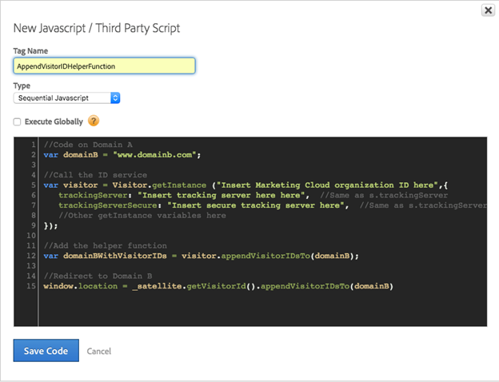

# 如何在Adobe动态标签管理器中设置Marketing CloudID服务辅助函数


本指南详细介绍了如何在Adobe动态标签管理器中设置Marketing CloudID服务帮助程序功能。

## 描述 {#description}


### <b>环境</b>

Adobe Experience Cloud

### <b>问题/症状</b>

本文介绍了如何实施Adobe Marketing Cloud ID服务 [附加访客ID函数](https://experienceleague.adobe.com/docs/id-service/using/id-service-api/methods/appendvisitorid.html?lang=zh-Hans) AdobeDynamic Tag Management (DTM)中的。

<b>注意：</b> 在中加载Marketing CloudID服务VisitorAPI.js 1.8.0或更高版本 [DTMMarketing CloudID服务](https://experienceleague.adobe.com/docs/id-service/using/id-service-api/methods/getmcvid.html) 在原始域和目标域中。 应在阻止Cookie以验证功能的浏览器情况下进行测试。


## 解决方法 {#resolution}


### <b>设置 — 域A</b>

使用域A上的自定义第三方Javascript在连续的“页面加载顶部”规则中设置目标域（域B）。

请参阅下面的屏幕截图作为示例：





```clike
//Code on Domain A
var domainB = "www.domainb.com";
 
//Call the ID service
var visitor = Visitor.getInstance ("Insert Marketing Cloud organization ID here",{
trackingServer:"Insert tracking server here here", //Same as s.trackingServer
trackingServerSecure: "Insert secure tracking server here", //Same as s.trackingServerSecure
...
//Other getInstance variables here
...
});
 
//Add the helper function
var domainBWithVisitorIDs = visitor.appendVisitorIDsTo(domainB);
 
//Redirect to Domain B
window.location = _satellite.getVisitorId().appendVisitorIDsTo(domainB)
```


<b>注意：</b> 要重定向到更明确的路径，域设置需要反映该意图。 如果重定向需要更加动态的构造，则可以将自定义代码添加到数据元素或直接调用规则中。 例如：`var domainB = "http://www.domainb.com/products/"`

### <b>验证 — 域B</b>

从域A导航到域B。通过在开发人员控制台中调用以下内容，验证域B上的MID是否与域A上的MID匹配：  `_satellite.getVisitorId().getMarketingCloudVisitorID()().appendVisitorIDsTo(domainB)`
