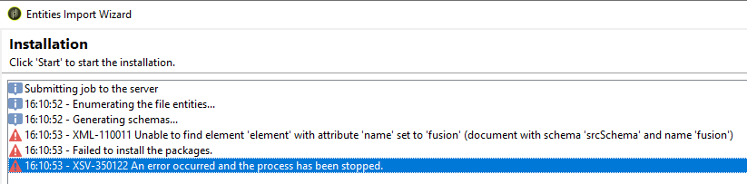

# 正在获取XML-110011找不到“fusion”元素

## 描述 {#description}

<b>环境</b>
Campaign ClassicV7

<b>问题/症状</b>
<u>对于内部用户</u>

将Campaign实例升级到ACC-21.1内部版本9342或更高版本后，在尝试安装任何Campaign包时，会出现以下错误：
 

## 解决方法 {#resolution}

融合模式(`xtk:fusion`)，应在升级后删除。 但在某些情况下，模式仍然存在。

在按如下方式查询数据库时，可能会看到以下记录：

要删除xtk:fusion架构，您需要使用“ — force”选项运行后置升级工具：

`nlserver config -postupgrade -allinstances -force`

您应会看到以下内容：

如果架构仍然存在，则可以尝试使用 `"-force -repair"` 选项：

`nlserver config -postupgrade -allinstances -force -repair`

如果仍然无法正常工作，则可能必须从数据库中手动删除记录。
