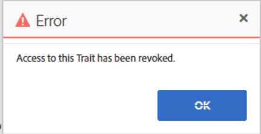

# 对AAM UI中无法保存或获取错误的模型进行故障诊断

## 描述 {#description}

<b>环境</b>
Audience Manager

<b>问题/症状</b>

<b>第1期：</b> 即使未达到模型限制，您仍无法在AAM客户UI中保存模型。 此外，在保存模型时，不会收到任何错误。 当您单击 <b>保存</b> 按钮，不会发生任何情况。

<b>第二期： </b>您无法在AAM客户UI中停用或删除模型。 停用或删除时，您会收到错误 *已吊销对此特征的访问权限。* 请找到以下屏幕截图。

## 分辨率 {#resolution}

<b>解决方案1:</b> 检查模型中区段使用的所有特征。 您可能会找到从Audience Marketplace中获取的特征，但未为您在模型中使用的特征启用建模订阅。 在这种情况下，您将无法保存模型。 要保存模型，请删除所有这些特征或启用这些特征的建模订阅。 请注意，如果要启用建模订阅，则可能需要为此支付额外费用。

<b>解决方案2: </b>克服此问题的可能方法之一：

检查模型中要停用或删除的区段所使用的所有特征。 您可能会找到一个不可用的特征。 查看以下屏幕截图：

删除所有不可用的特征，然后尝试停用或删除模型。 现在，您可能能够成功停用或删除模型。

*注意：在UI中收到错误消息时，您可能需要在使用Chrome时启用开发人员工具，并选择网络选项卡，然后重试并复制上述操作。 开发人员工具可能会显示更多详细信息，包括无法完成操作的依赖项。 这可能有助于您了解UI错误的原因。*
