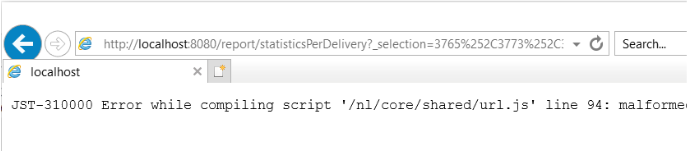

# 由于IE限制，投放报告无法在ACC中聚合统计信息


了解如何解决(IE) Internet Explorer中的URL长度为2048个字符的Campaign Classic问题。 通过从Adobe Campaign Classic (ACC)将URL复制到报表来解决此问题。

## 描述 {#description}


### 环境

Adobe Campaign Classic

### 问题/症状

此问题与Internet Explorer中的最大URL长度（2048个字符）有关： [详细信息](https://support.microsoft.com/en-us/topic/maximum-url-length-is-2-083-characters-in-internet-explorer-174e7c8a-6666-f4e0-6fd6-908b53c12246).

此页的HTML源在ACC用户控制台中显示报告。

内的URL `href` 属性 `<` a`>`  标记没有问题，即它们不会被截断。 但是，如果在IE中复制并粘贴URL，则会将链接截断为2,048个字符，并且您将无法打开它：



在用户控制台内右键单击报告并选择 *在新窗口中打开*. 这将自动打开IE，但地址栏将为空。 如果选择的投放较少，并且重复了这些步骤，则IE打开时将使用正确的URL。

目前，正在努力使用Edge替换IE。 Edge基于Chromium，没有这些URL限制。 这一点已通过将URL复制粘贴到Edge中得到确认，这样不会截断URL，并且打开报告时不会出现任何问题：


## 解决方法 {#resolution}


完成从IE到Edge的过渡后，应自动解决此问题。 在此之前，可以部署以下解决方法：

- 通过右键单击报告，然后选择 *复制快捷方式*. 这应该会将整个URL复制到剪贴板中。
- 需要对URL稍作修改，以便能够在其他浏览器中打开。 复制的URL将遵循以下模式：


  ```
  javascript:switchToReportView(%22statisticsPerDelivery%22,%20%22/report/statisticsPerDelivery?_selection=3765%252C37...
  ```


- URL中从“ ”开始的部分 `/report/` 需要复制并附加到实例的地址。 在这种情况下，地址为 *localhost*：


  ```
  http://localhost:8080/report/statisticsPerDelivery?_selection=3765%252C3773%252C3781%252C3789%252C3793%252C3769%...
  ```


- 将生成的URL复制到另一个浏览器（Edge、Firefox或Chrome应该都能正常工作）。

