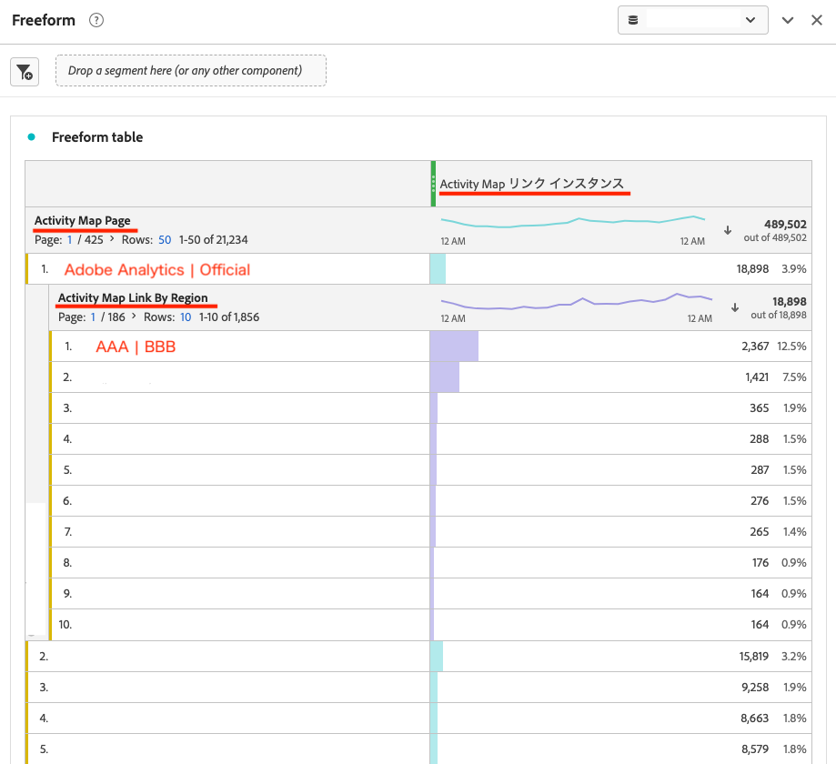

# 如何在Analytics Workspace中重现有关自由格式表的Activity Map链接报告

了解如何在Analytics Workspace中重现有关自由格式表的Activity Map链接报告。

## 描述 {#description}

<b>环境</b>

- Customer Journey Analytics
- Analytics

### <b>问题/症状</b>

如何在Adobe Analytics工作区的“自由格式表”上重现链接报表？ 可以使用哪些量度和Dimension来生成此数据？

## 解决方法 {#resolution}

以下是一个示例。

1. 在Adobe Analytics中打开新项目 *工作区* 并放置 *自由格式表* 从左边栏进入面板。
2. 接下来，匹配 *日期范围* 在Activity Map中报告的时段的面板中。
3. 对于 *Dimension*，使用 *Activity Map页* 和 *Activity Map链接和地区*. 放下 *Activity Map页* 在自由格式表中，然后放置 *Activity Map链接和地区* 在要报告的页面上。 显示的项目将是以下项目的组合： *链接Id* 和 *区域* Activity Map中显示的项目 *链接报表*. (示例： `Link ID=AAA` | `Region=BBB`)
4. 使用 *Activity Map实例* 对象 *量度*. 插入此 *Activity Map实例* 放入顶部的“量度”放置区域中。
5. 现在，您可以在 *自由格式表* 在 *链接报表*.

·Analytics中的Activity Map报表 — AnalyticsActivity Map维度
[https://experienceleague.adobe.com/docs/analytics/analyze/activity-map/activitymap-reporting-analytics.html](https://experienceleague.adobe.com/docs/analytics/analyze/activity-map/activitymap-reporting-analytics.html)

<b>注意</b>：比较Activity Map的 *链接报表* 使用 *自由格式表*，您可能会发现 *链接ID*&#x200B;在 *自由格式表* 中未显示于 *链接报表*. 这是因为Activity Map的 *链接报表* 和 *自由格式表*&#x200B;是不一样的。 在 *链接报表*，则只报告在启动Activity Map并加载该页面时存在的链接元素。 另一方面，在 *自由格式表*，则所有过去点击过并在Activity Map中测量的链接都将包含在报表中，即使该链接当前不存在于目标页面上。 在这种情况下，您需要使用 *区段* 或 *筛选* 函数以移除以下对象上不必要的项： *自由格式表*.
