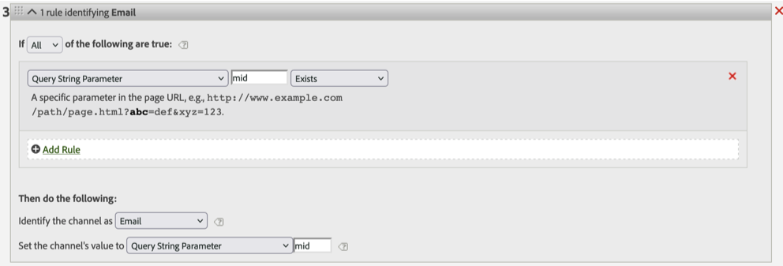

# 为什么页面URL会跳过链接跟踪调用

## 描述 {#description}

<b> 环境</b>
- Adobe Analytics

<b>问题/症状</b>
假设您有如下营销渠道处理规则，如果页面URL具有“mid”查询字符串参数，则它应该属于“电子邮件”渠道。
但是，在某些情况下，带有如下所示的“mid”查询参数的页面URL可能会被“电子邮件”渠道忽略并归为其他渠道。
`[` 1`]`  [http://www.example.com/home.html?mid=123](http://www.example.com/home.html?mid=123)
`[` Image1`]`

## 解决方法 {#resolution}

检查服务器调用类型为 [链接跟踪](https://experienceleague.adobe.com/docs/analytics/implementation/vars/functions/tl-method.html?lang=zh-Hans) 例如自定义链接而不是页面查看。 如果是链接跟踪调用，则按设计工作。

根本原因：

Adobe数据收集服务器从所有维度中删除pageURL维度 [链接跟踪](https://experienceleague.adobe.com/docs/analytics/implementation/vars/functions/tl-method.html?lang=zh-Hans) 图像请求。 因此，页面URL匹配规则不适用于链接跟踪调用。

以下是有关pageURL [https://experienceleague.adobe.com/docs/analytics/implementation/vars/page-vars/pageurl.html?lang=en](https://experienceleague.adobe.com/docs/analytics/implementation/vars/page-vars/pageurl.html?lang=zh-Hans)
