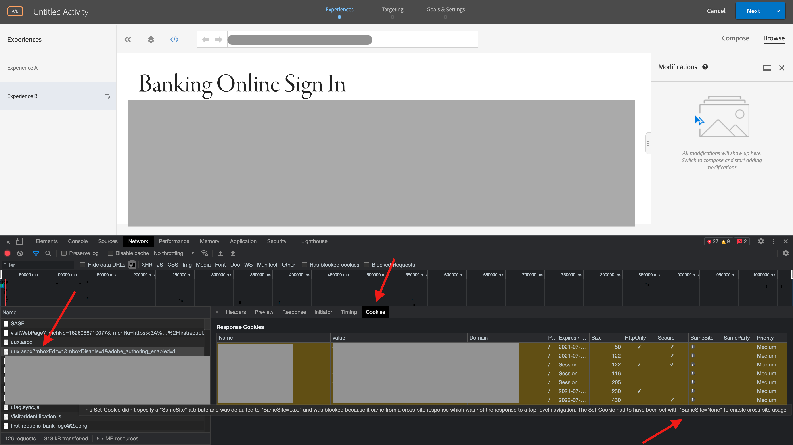

# Adobe Target EEC故障排除

有关Adobe Target EEC通过列入允许列表以下IP地址进行故障排除的详细指南。 (联系IT团队允许列表以下IP地址)

## 描述 {#description}

<b>环境</b>
Adobe Target

### 问题/症状

<b>EEC相关常见问题</b>
1. EEC无法加载在公共IP上不可访问的内部QA URL。
2. 查看超时或&quot;*访问被拒绝*&#x200B;加载启用了代理的网站时出现“错误。 （仅限EEC）
3. 阻止EEC的网站域。

## 解决方法 {#resolution}

<b>问题： </b>您的网站域(ISP)正在阻止增强型体验编辑器。

<b>解决方案：</b> 允许列表下面列出的IP地址(请让您的IT团队列入允许列表以下IP地址)：

- 99.80.139.221
- 54.78.56.224
- 54.247.179.246
- 54.80.219.243
- 34.201.235.54
- 54.196.224.236
- 35.75.212.45
- 52.199.184.130
- 18.180.161.176

关闭 <b>增强型体验编辑器</b> 在 <b>配置</b> `>` <b> 页面交付菜单。</b>

<b>问题：</b> 加载启用了代理的网站时，您会看到超时或“访问被拒绝”错误。 （仅限EEC）

<b>解决方案： </b>请确保代理IP在您的环境中未被阻止。

<b>问题： </b>EEC无法加载使用TLS 1.0的网站上的安全页面。 （仅限EEC）

<b>解决方案： </b>您可能会看到上文“增强型可视化体验编辑器不会在我的网站的安全页面中加载”中所述的错误消息。 如果上述IP地址已分配给您，但您的网站不支持TLS版本1.2。

Target当前使用默认配置1.2。在Target 18.4.1（2018年4月25日）之前，默认配置支持TLS 1.0。

如何检查浏览器使用的TLS版本
1. 在Chrome中打开受影响的网站。
2. 从Chrome菜单（三个垂直省略号）中，单击“更多工具” `>`  开发人员工具。

3.打开“安全”选项卡，然后检查“连接”下的TLS版本信息

