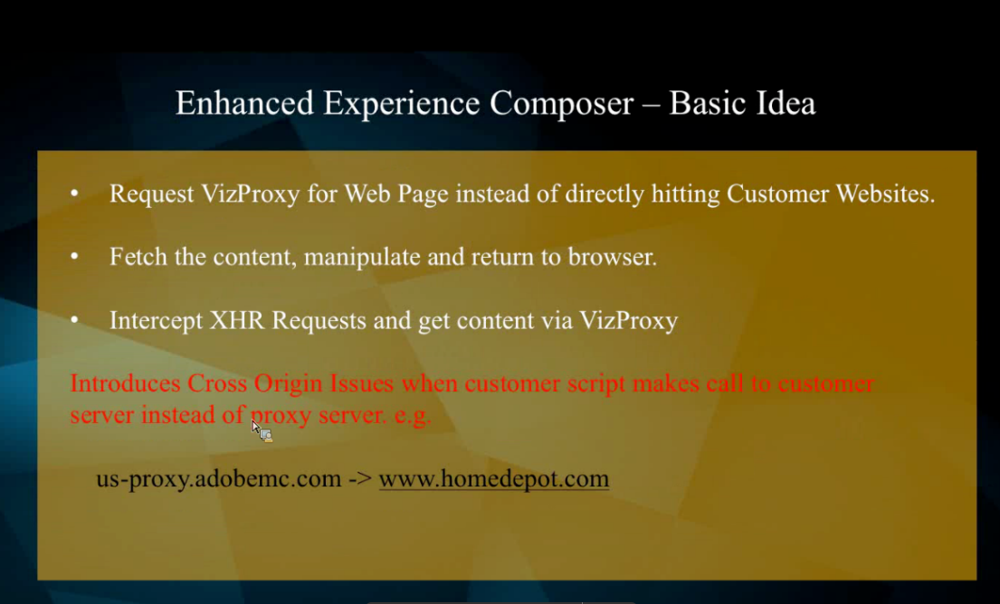

# 网站域在加载站点时阻止增强型体验编辑器或访问被拒绝

## 描述 {#description}

### <b>环境</b>

Adobe Target

### <b>问题</b>

本文旨在解决我们在Target增强型体验编辑器中面临的一些常见问题/错误，例如：

- 错误，如 — &quot;*您的网站域正在阻止增强型体验编辑器*”或“*访问被拒绝*&#x200B;加载启用了代理的网站时出现“错误”
- EEC无法加载在公共IP上不可访问的内部QA URL。
- EEC不会在使用TLS 1.0的网站上加载安全页面。 （仅限EEC）。

## 解决方法 {#resolution}

<b>EEC功能：</b>

### EEC问题故障排除步骤

A.对于“ ”等EEC错误&#x200B;*您的网站域正在阻止增强型体验编辑器*”或“*EEC无法加载在公共IP上不可访问的内部QA URL*&quot;

如果您看到，请将以下DNS/IP列入白名单 *超时* 或这些请求中的其他400条消息 <b>控制台</b> 选项卡（在Chrome开发人员工具中）：

<b>美国：</b>
vizproxy-prod-us-2024941706.us-east-1.elb.amazonaws.com.
54.173.241.58 3.234.111.144

<b>欧洲、中东和非洲：</b>
vizproxy-prod-emea-1118976074.eu-west-1.elb.amazonaws.com.
34.246.105.190 34.249.15.238

<b>亚太地区：</b>
vizproxy-prod-apac-1398366183.ap-northeast-1.elb.amazonaws.com.
52.192.148.53 52.69.47.228

B. TLS问题

请按照以下步骤检查网站的TLS版本：

1. 右键单击受影响的页面并打开 <b>inspect元素</b> （开发人员控制台）。
2. 在开发人员控制台的最右上角（齿轮图标旁边）将显示3个圆点。 单击该图标并展开 <b>更多工具</b> 选项。
3. 选择<b> 安全性</b> 选项，这将显示我们的TLS版本。    
4. 如果当前版本为1.0，请联系客户关怀团队以更改TLS版本

