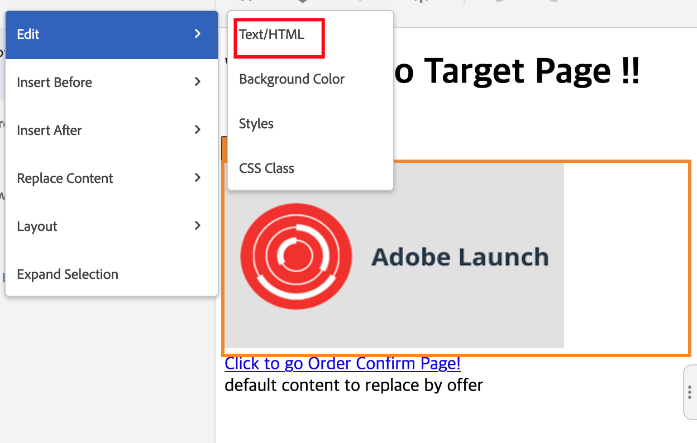

# 交换图像在Target VEC中无法正常工作

## 描述 {#description}

<b>环境</b>

- Adobe Target

<b>问题/症状</b>

在Adobe Target VEC中，通过Adobe Target VEC替换内容图像在页面上交换图像后，图片无法正确加载，或者有时，VEC编辑窗口右侧的“修改”窗口中可能会出现错误图标。

## 分辨率 {#resolution}

通过单击“展开选择”菜单并替换HTML代码中的HTML集属性值，尝试在父容器上使用编辑操作。

<b>原因</b>

VEC中的“交换图像”操作基于img标记的src属性，不适用于srcset属性。
