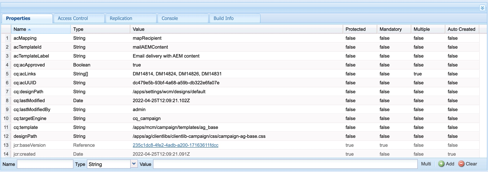

# AEM电子邮件模板未与Adobe Campaign同步。

## 描述

当用户尝试复制并粘贴已执行营销活动批准工作流的网站模板时，复制并粘贴操作期间，不会删除Adobe Campaign的cq:acLinks和cq:acUUID属性。
    因此，Adobe营销活动无法从AEM同步电子邮件模板，并放弃错误：作为cq:acLinks和cq:acUUID属性找到的重复acUUID是唯一的属性。
    <b>重现问题的步骤：</b>
 1:在AEM中创建网站的电子邮件模板。
 2:运行营销活动批准工作流。
 3:通过完成工作流步骤来批准模板。
 4:导航到crx/de。
 5:复制/粘贴的模板将包含cq:acLinks和cq:acUUID属性。

<b>日志中的错误：</b>
 在错误日志中找不到相关错误。     <b>复制粘贴操作后crx/de中模板的属性：</b>     <b>经验丰富的行为：</b>          <b>预期行为：</b>
    

## 分辨率

campaign-property-modification-service是用于修改复制粘贴功能上促销活动新闻稿的属性的服务用户。
此usercampaign-property-modification-service应具有对内容文件夹的读取和修改权限。

如果它没有对内容文件夹的读取和修改权限，则无法清理复制粘贴的站点模板的cq:acLinks和cq:acUUID属性。

为用户提供必要的权限后，将清理属性。

<b>用户权限屏幕截图：</b>

