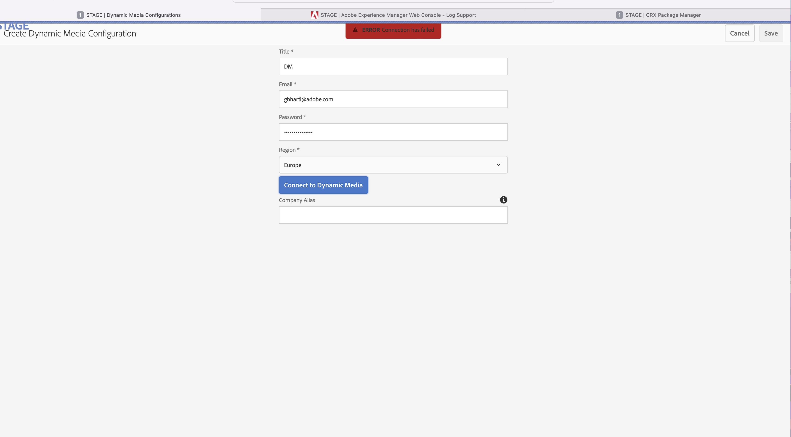

# 升级到Service Pack 11后，无法在AEM中创建Dynamic Media配置。


探索AEM问题Service Pack 11更新后的疑难解答，包括连接失败、NullPointerExceptions和JAXB-API挑战。

## 描述 {#description}


<b>环境</b>

- Adobe Dynamic Media Classic

- Adobe体验管理

<b>问题/症状</b>

将AEM更新到Service Pack 11后，管理员无法在全局文件夹中创建Dynamic Media配置。

错误：连接失败显示在UI中。

仅当将Service Pack升级到11后才会出现问题。

<b>屏幕快照：</b>



<b>日志中的错误：</b>


```
ERROR: The following errors can be seen in the error logs:

ERROR [ 88.198.190.189 [ 1649063458948]  POST /libs/settings/dam/scene7/endpoints/europe/jcr:content.companies.json HTTP/1.1]  org.apache.sling.engine.impl.SlingRequestProcessorImpl service: Uncaught Throwable

java.lang.NullPointerException: null

In the console, this error is printed:

POST http://18.193.241.174:4502/libs/settings/dam/scene7/endpoints/europe/jcr:content.companies.json 500 (Server Error)


These additional errors can also be seen in the error logs:

ERROR Apache Sling Repository Startup Thread #1 com.day.cq.dam.scene7.impl.utils.RequestUtils Unable to create jaxbinstance :

javax.xml.bind.JAXBException: Implementation of JAXB-API has not been found on module path or classpath.

ERROR [ 88.198.190.189 [ 1649328294390]  POST /libs/settings/dam/scene7/endpoints/europe/jcr:content.companies.json HTTP/1.1]  com.day.cq.dam.scene7.impl.utils.Request

Utils Unable to create jaxbinstance :

java.lang.NullPointerException: null

ERROR [ sling-oak-observation-1]  com.day.cq.dam.scene7.impl.utils.RequestUtils Unable to create jaxbinstance :

java.lang.NullPointerException: null
```


<b>重现问题的步骤：</b>
<br>`[` 1`]` ：导航到工具 — `>`  Cloud Service。
<br>`[` 2`]` ：单击Dynamic Media配置。
<br>`[` 3`]` ：尝试连接到Dynamic Media。  
<br> <br>


## 解决方法 {#resolution}


我们需要从系统/控制台中删除以下捆绑包（如果存在）

1. jaxb注释v2.9.8
2. jaxb api v2.3.1


删除上述捆绑包后，AEM应仅保留这些捆绑包 — 

1. jaxb运行时v2.3.2.2
2. jaxb-api-2.3 v2.3.0.3


按照上述步骤，重新启动安装程序，您应该能够创建Dynamic Media配置。
