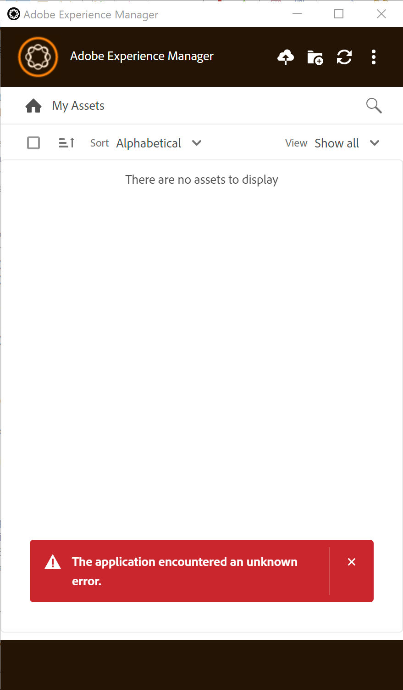

# AEM桌面应用程序 — 应用程序遇到未知错误

了解如何解决AEM桌面应用程序连接到AEM创作实例的Adobe Experience Manager问题。

## 描述 {#description}

<b>环境</b>
Adobe Experience Manager (AEM)

<b>问题</b>
按照中所述的步骤安装和配置AEM桌面应用程序后 [安装Adobe Experience Manager桌面应用程序](https://experienceleague.adobe.com/docs/experience-manager-desktop-app/using/install-upgrade.html?lang=en#install-v2) 从AEM桌面应用程序指南中，当连接到AEM创作实例时，应用程序会给出错误“*应用程序遇到未知错误*r”。
             

## 解决方法 {#resolution}

<b>解决方案</b>
在中的步骤8，此问题可重现 [安装Adobe Experience Manager桌面应用程序](https://experienceleague.adobe.com/docs/experience-manager-desktop-app/using/install-upgrade.html?lang=en#install-v2) 在AEM桌面应用程序指南中， URL <b>http://`[` aem_server`]` ：`[` 端口`]` /assets.html/content/dam</b> 用于与Experience Manager存储库的连接，而不是 <b>http://`[` aem_server`]` ：`[` 端口`]` </b>.
