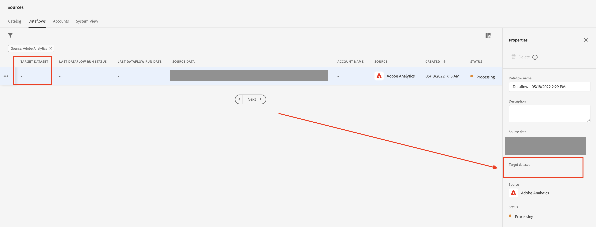

# AEP — 即使设置了连接器，Adobe Analytics数据也不会流入

## 描述

在本例中，即使已设置源连接器，Adobe Analytics数据仍未流入。

## 分辨率

检查数据流配置后，发现它没有目标数据集。 缺少目标数据集是数据流未摄取任何数据的原因。

在源中，只需转到 [!UICONTROL 数据流] 选项卡，并选择相关数据流，检查&#39;[!UICONTROL Target数据集]“ — 请参阅下文：

如果为空，则必须重新创建新的数据流。
