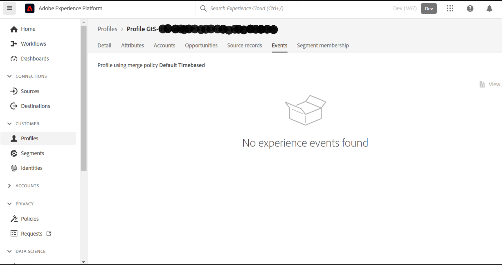

# [!UICONTROL 事件] 在AEP中对用户档案不可见

## 描述

我无法在“”下查看配置文件的数据[!UICONTROL 事件]“ ”选项卡。          
- 我已创建XDM事件架构和数据集。
- [!UICONTROL 数据摄取] 已通过csv文件上传完成。

## 分辨率

[!UICONTROL 事件] 选项卡实时显示收到的不包含csv文件上传的用户档案事件/请求的数据。

来自WebSDK/Alloy.js或通过任何流方法发出的请求将在“[!UICONTROL 事件]“ ”选项卡。
