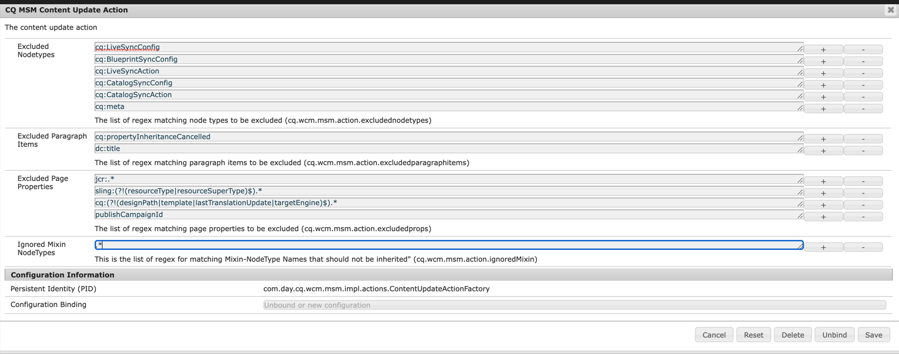

# 由于mixin（和使用经典UI）冲突，转出失败

## 描述


由于存在一些冲突，转出页面失败 *jcr:mixinTypes* 的缩略图节点。

在页面配置了缩略图时，会发生冲突 <b>使用经典UI</b> 然后开始推出（首次推出作品）。

此时，由于页面缩略图结构上的mixin冲突，因此转出主控页面失败，这两者之间有：

- dam：缩略图
- cq:LiveRelationship


日志中的给定错误如下：


```
27.07.2022 15:48:07.091 *ERROR* 0:0:0:0:0:0:0:1 1658929687039 POST /bin/wcmcommand HTTP/1.1 com.day.cq.wcm.msm.impl.commands.RolloutCommand Error during roll-out.
com.day.cq.wcm.api.WCMException: com.day.cq.wcm.api.WCMException: com.day.cq.wcm.api.WCMException: com.day.cq.wcm.api.WCMException: com.day.cq.wcm.api.WCMException: com.day.cq.wcm.api.WCMException: javax.jcr.nodetype.ConstraintViolationException: No matching node definition found for dam:thumbnails
    at com.day.cq.wcm.msm.impl.RolloutManagerImpl.rolloutResource(RolloutManagerImpl.java:824) com.day.cq.wcm.cq-msm-core:5.11.84
    at com.day.cq.wcm.msm.impl.RolloutManagerImpl.rolloutPage(RolloutManagerImpl.java:693) com.day.cq.wcm.cq-msm-core:5.11.84
    at com.day.cq.wcm.msm.impl.RolloutManagerImpl.rolloutPageRelations(RolloutManagerImpl.java:624) com.day.cq.wcm.cq-msm-core:5.11.84
    at com.day.cq.wcm.msm.impl.RolloutManagerImpl.rollout(RolloutManagerImpl.java:515) com.day.cq.wcm.cq-msm-core:5.11.84
    at com.day.cq.wcm.msm.impl.commands.RolloutCommand.performCommand(RolloutCommand.java:153) com.day.cq.wcm.cq-msm-core:5.11.84
    at com.day.cq.wcm.core.impl.commands.WCMCommandService$CommandHolder.performCommand(WCMCommandService.java:178) com.day.cq.wcm.cq-wcm-core:5.11.312
    at com.day.cq.wcm.core.impl.commands.WCMCommandServlet.performCommand(WCMCommandServlet.java:120) com.day.cq.wcm.cq-wcm-core:5.11.312
    at com.day.cq.commons.servlets.AbstractCommandServlet.doPost(AbstractCommandServlet.java:49) com.day.cq.cq-commons:5.11.18
    at org.apache.sling.api.servlets.SlingAllMethodsServlet.mayService(SlingAllMethodsServlet.java:146) org.apache.sling.api:2.20.0
    at org.apache.sling.api.servlets.SlingSafeMethodsServlet.service(SlingSafeMethodsServlet.java:342) org.apache.sling.api:2.20.0
    ..
Caused by: com.day.cq.wcm.api.WCMException: com.day.cq.wcm.api.WCMException: com.day.cq.wcm.api.WCMException: com.day.cq.wcm.api.WCMException: com.day.cq.wcm.api.WCMException: javax.jcr.nodetype.ConstraintViolationException: No matching node definition found for dam:thumbnails
    at com.day.cq.wcm.msm.impl.RolloutManagerImpl.rolloutResource(RolloutManagerImpl.java:824) com.day.cq.wcm.cq-msm-core:5.11.84
    at com.day.cq.wcm.msm.impl.RolloutManagerImpl.rolloutResource(RolloutManagerImpl.java:811) com.day.cq.wcm.cq-msm-core:5.11.84
    ... 135 common frames omitted
Caused by: com.day.cq.wcm.api.WCMException: com.day.cq.wcm.api.WCMException: com.day.cq.wcm.api.WCMException: com.day.cq.wcm.api.WCMException: javax.jcr.nodetype.ConstraintViolationException: No matching node definition found for dam:thumbnails
    at com.day.cq.wcm.msm.impl.RolloutManagerImpl.rolloutResource(RolloutManagerImpl.java:824) com.day.cq.wcm.cq-msm-core:5.11.84
    at com.day.cq.wcm.msm.impl.RolloutManagerImpl.rolloutResource(RolloutManagerImpl.java:811) com.day.cq.wcm.cq-msm-core:5.11.84
    ... 136 common frames omitted
Caused by: com.day.cq.wcm.api.WCMException: com.day.cq.wcm.api.WCMException: com.day.cq.wcm.api.WCMException: javax.jcr.nodetype.ConstraintViolationException: No matching node definition found for dam:thumbnails
    at com.day.cq.wcm.msm.impl.RolloutManagerImpl.rolloutResource(RolloutManagerImpl.java:824) com.day.cq.wcm.cq-msm-core:5.11.84
    at com.day.cq.wcm.msm.impl.RolloutManagerImpl.rolloutResource(RolloutManagerImpl.java:811) com.day.cq.wcm.cq-msm-core:5.11.84
    ... 137 common frames omitted
Caused by: com.day.cq.wcm.api.WCMException: com.day.cq.wcm.api.WCMException: javax.jcr.nodetype.ConstraintViolationException: No matching node definition found for dam:thumbnails
    at com.day.cq.wcm.msm.impl.RolloutManagerImpl.rolloutResource(RolloutManagerImpl.java:824) com.day.cq.wcm.cq-msm-core:5.11.84
    at com.day.cq.wcm.msm.impl.RolloutManagerImpl.rolloutResource(RolloutManagerImpl.java:811) com.day.cq.wcm.cq-msm-core:5.11.84
    ... 138 common frames omitted
Caused by: com.day.cq.wcm.api.WCMException: javax.jcr.nodetype.ConstraintViolationException: No matching node definition found for dam:thumbnails
    at com.day.cq.wcm.msm.commons.BaseAction.execute(BaseAction.java:154) com.day.cq.wcm.cq-msm-commons:1.1.2
    at com.day.cq.wcm.msm.impl.RolloutManagerImpl.rolloutResource(RolloutManagerImpl.java:790) com.day.cq.wcm.cq-msm-core:5.11.84
    ... 139 common frames omitted
Caused by: javax.jcr.nodetype.ConstraintViolationException: No matching node definition found for dam:thumbnails
    at org.apache.jackrabbit.oak.plugins.nodetype.EffectiveNodeTypeImpl.getNodeDefinition(EffectiveNodeTypeImpl.java:454) org.apache.jackrabbit.oak-core:1.8.22
    at org.apache.jackrabbit.oak.plugins.nodetype.ReadOnlyNodeTypeManager.getDefinition(ReadOnlyNodeTypeManager.java:396) org.apache.jackrabbit.oak-core:1.8.22
    at org.apache.jackrabbit.oak.jcr.session.NodeImpl$29.perform(NodeImpl.java:1031) org.apache.jackrabbit.oak-jcr:1.8.22
    at org.apache.jackrabbit.oak.jcr.session.NodeImpl$29.perform(NodeImpl.java:1023) org.apache.jackrabbit.oak-jcr:1.8.22
    at org.apache.jackrabbit.oak.jcr.delegate.SessionDelegate.perform(SessionDelegate.java:207) org.apache.jackrabbit.oak-jcr:1.8.22
    at org.apache.jackrabbit.oak.jcr.session.ItemImpl.perform(ItemImpl.java:112) org.apache.jackrabbit.oak-jcr:1.8.22
    at org.apache.jackrabbit.oak.jcr.session.NodeImpl.getDefinition(NodeImpl.java:1023) org.apache.jackrabbit.oak-jcr:1.8.22
    at com.day.cq.wcm.msm.commons.ItemFilterImpl.excludes(ItemFilterImpl.java:91) com.day.cq.wcm.cq-msm-commons:1.1.2
    at com.day.cq.wcm.msm.impl.actions.ContentCopyActionFactory$ContentCopyAction.applyFilters(ContentCopyActionFactory.java:293) com.day.cq.wcm.cq-msm-core:5.11.84
    at com.day.cq.wcm.msm.impl.actions.ContentCopyActionFactory$ContentCopyAction.createCopy(ContentCopyActionFactory.java:245) com.day.cq.wcm.cq-msm-core:5.11.84
    at com.day.cq.wcm.msm.impl.actions.ContentCopyActionFactory$ContentCopyAction.doExecute(ContentCopyActionFactory.java:208) com.day.cq.wcm.cq-msm-core:5.11.84
    at com.day.cq.wcm.msm.commons.BaseAction.execute(BaseAction.java:134) com.day.cq.wcm.cq-msm-commons:1.1.2
    ... 140 common frames omitted
```


<b>重现步骤：</b>

1. 启动香草AEM 6.5.13.0
2. 转到 <b>/siteadmin</b> (因此 <b>经典UI</b>)
3. 打开的页面属性 */content/we-retail/language-intern/en/women*
4. 在图像中 *选项卡* 将任何图像设置为缩略图
5. 转出页面
6. 现在转到 <b>站点UI</b>
7. 打开的页面属性 */content/we-retail/us/en/women* 再次
8. 在 *缩略图* ，单击 *生成预览* 并保存更改
9. 现在在/siteadmin中再次转出页面


## 分辨率


此问题在转出过程中发生，因为AEM无法为Live Copy页面(/content/we-retail/us/en/women/jcr:content/image/file/jcr:content)在jcr:content下创建“dam:thumbnails”节点，原因是在转出过程中出现混合类型“dam:Thumbnails”未应用于Live Copy页面节点“/content/we-retail/us/en/jcr:content/file/jcr:cr:content”和“tm:Tont”文件夹只能在“dam:Node:Type”下创建。

MSM默认行为是在转出0期间忽略添加到源节点中的新mixin，因此不会将其添加到“/content/we-retail/us/en/women/jcr:content/image/file/jcr:content”。

要解决此问题，可以通过内容更新操作配置更改此行为。
默认将忽略每种混合类型，如以下屏幕截图所示：



应更新以使用：


```
(?!.*dam:Thumbnails).*
```


如以下屏幕截图所示：


这应该可以解决问题。

0https://experienceleague.adobe.com/docs/experience-manager-64/administering/introduction/msm-sync.html?lang=en#excluding-properties-and-node-types-from-synchronization
