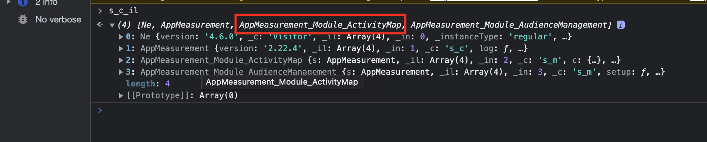

# 如何禁用Active Map数据收集？

## 描述

出于某些原因，我们不想再收集Active Map数据；如何禁用Active Map数据收集？
  

## 分辨率

- <b>是否在客户服务器（AppMeasurement.js自托管）上管理Adobe Analytics库</b>

从AppMeasurement.js文件中删除AppMeasurement_Module_ActivityMap模块

- <b>是否在Adobe端(通过AdobeCDN托管的AppMeasurement.js)上管理Adobe Analytics库</b>

在AEP数据收集(Launch)UI中，转到Adobe Analytics扩展的配置，通过取消选中框禁用Activity Map，然后发布内部版本

- 

- <b>禁用活动映射后，请通过“s_c_il”命令检查活动映射模块未通过浏览器“控制台”菜单加载</b>

已加载Active Map模块

未加载Active Map模块

- <b>禁用Active Map后，通过浏览器“网络”菜单检查Adobe Analytics服务器调用</b>.

