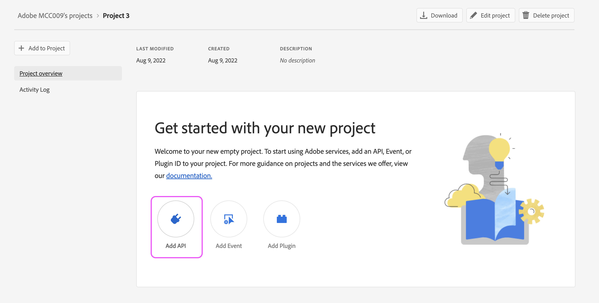

# 如何设置AAM API访问

## 描述

本文概述了如何在开发人员控制台中创建项目以生成Audience ManagerAPI JWT凭据。

## 分辨率

您需要Admin Console中的系统管理员权限才能生成Audience ManagerAPI的凭据。 步骤1和2概述了如何授予这些呈报的权限。 当前系统管理员可能更愿意自己执行这些步骤，而不是向其他用户授予呈报的管理员权限，在这种情况下，直接跳到步骤3。

1. 导航到 [Admin Console](https://adminconsole.adobe.com/) ，然后选择 [!UICONTROL 添加管理员] 从 [!UICONTROL 快速链接] 菜单：

   

1. 输入要授予访问权限的所有用户的电子邮件。 在下一页，选择“[!UICONTROL 系统管理员]“”表示权限级别：

   

1. 导航到 [https://developer.adobe.com/console](https://developer.adobe.com/console) . 如果尽管在上述步骤中已获得系统管理员权限，但您仍无权访问，请尝试刷新Cookie/缓存。

1. 从 [!UICONTROL 快速入门] 菜单(或 [!UICONTROL 项目] 菜单):

   

1. 将Audience ManagerAPI添加到您的项目：

   

   

1. 请按照以下步骤生成（或上传）您的JWT凭据。 如果选择通过开发控制台生成凭据，请确保安全地存储私钥。 在后续步骤中，您将需要私钥。 

   

1. 接下来，系统会提示您将凭据分配给相关的产品用户档案。 如果贵组织使用基于角色的访问控制，则需要按照以下步骤创建技术用户帐户并将该帐户添加到相关的RBAC组： [https://experienceleague.adobe.com/docs/audience-manager/user-guide/api-and-sdk-code/rest-apis/aam-api-getting-started.html?lang=en#technical-account-rbac-permissions](https://experienceleague.adobe.com/docs/audience-manager/user-guide/api-and-sdk-code/rest-apis/aam-api-getting-started.html?lang=en#technical-account-rbac-permissions)

1. 完成这些步骤后，您可以生成访问令牌以发出第一个API请求。 首先，单击开发控制台中的凭据概述页面：

   

1. 单击页面顶部的“生成JWT”选项卡，并从步骤6中下载的文件中粘贴整个私钥，然后单击“生成令牌”：

   

最后，您可以利用上一步中检索的访问令牌，发起API请求。 可以从任何API平台进行调用，例如 [!DNL Postman]，直接通过cURL命令，甚至通过我们的API文档页面： [https://bank.demdex.com/portal/swagger/index.html#/](https://bank.demdex.com/portal/swagger/index.html#/)

要使用我们文档中的演示功能进行调用，请按照上述步骤生成您的令牌，然后单击页面右侧的“授权”并输入您的令牌：

另外，请确保您选择aam.adobe.io服务器，如上面的屏幕截图所示。 现在，您可以通过输入相关参数并单击“Try it out”按钮，对任何API请求使用演示功能：

请记住，这将向您的实例发送真实的API请求。 如果您使用 `DELETE`, `PUT`或 `POST` 请求时，您可能正在对实例进行未预期的更改。 在发送请求之前，请务必仔细阅读每个API调用的文档。
