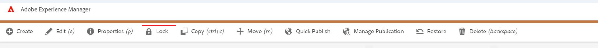

# 页面解锁选项不起作用

## 描述 {#description}


### 环境

Experience Manager

### 问题/症状`>`

尝试通过页面侧栏锁定/解锁页面时 `[` 图像1`]` ，您可以锁定它。 但是，当您尝试解锁时，会出现错误 `[` 图像2`]`  被抛出。

另一方面，您可以通过站点管理控制台成功锁定/解锁页面 `[` 图像3`]` .

<u><b>`[` 图像1`]` </b></u>


<u><b>`[` 图像2`]` </b></u>


<u><b>`[` 图像3`]` </b></u>




## 解决方法 {#resolution}


错误 `[` 1`]`  尝试解锁页面时出现问题，因为该页面不包含 `cq.shared` 客户端库。

要解决此问题，您需要为上述客户端库添加依赖关系，以便为自定义内容页面加载它。

<b>`[` 1`]` </b>


```
core.lc-ca7bc91540b118ca20ea6d0db684341c-lc.min.js:1039 Uncaught TypeError: Cannot read properties of undefined (reading 'shared') 
at HTMLButtonElement.unlockPage (core.lc-ca7bc91540b118ca20ea6d0db684341c-lc.min.js:1039:177) 
at HTMLDocument.dispatch (jquery.lc-7842899024219bcbdb5e72c946870b79-lc.min.js:126:340) 
at h.handle (jquery.lc-7842899024219bcbdb5e72c946870b79-lc.min.js:120:65)
```

