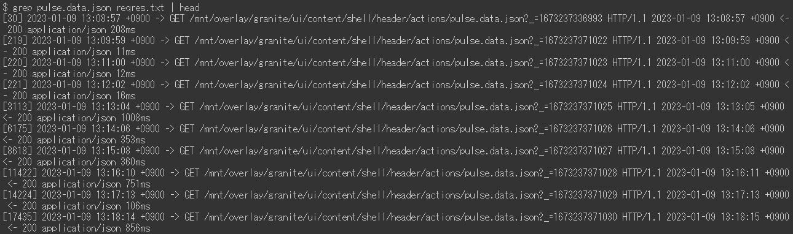
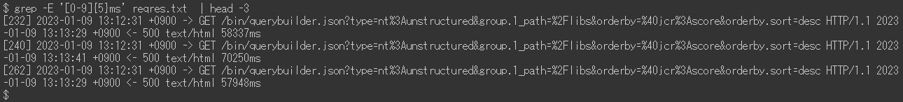
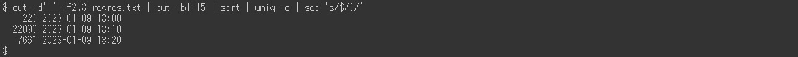

# request.log分析示例 | AEP

## 描述 {#description}

<b>环境</b>
Experience Manager 6.5

<b>问题/症状</b>
Adobe Experience Manager(AEM) `request.log` 包含各种有用信息（如响应时间），用于分析性能问题。 这是使用 Linux 命令（包括一些外部命令）的分析示例列表。

## 解决方法 {#resolution}

<b>目录：</b>
简介
 request.log 的格式

准备步骤

1. 数据清理
2. 重启时间
3. 每小时访问次数
4. 最大并发处理
5. 拆分日志文件
6. 合并请求记录和响应记录

分析示例

1. 最大量的访问
2. 缺少响应的访问
3. 访问速度慢
4. 响应时间的时间序列数据
5. 最小值、中间值（平均）、中位值、最大响应时间
6. 一段时间内的访问次数
7. 一段时间内的响应状态次数
8. 最常见的 URL
9. access.log 记录一条 request.log 记录

结论

<b>简介</b>

<u>request.log 的格式</u>

AEM 6.5 默认生成以下格式的 request.log。由于系统限制，本文中的命令行显示为图像而非纯文本。

request.log 的示例：

在本文中，我将带有“-”的行称为“请求记录”。 带有“-”的行是“响应记录”。

请求记录
 当 AEM 收到请求时，会记录请求记录。它包含接收日期和时间、请求 ID、请求方法和 URL。

响应记录
 当 AEM 响应请求时，将会记录响应记录。它包含响应的日期和时间、请求 ID、状态代码、内容类型和响应时间（以毫秒为单位）。

另见相应手册：
https://experienceleague.adobe.com/docs/experience-manager-65/deploying/configuring/monitoring-and-maintaining.html?lang=en#interpreting-the-request-log

<b>准备步骤：</b>

<u>步骤 1. 数据清理</u>

在深入分析 request.log 之前，对日志记录进行标准化很重要。

第一个 sed 命令在响应记录的 Content-Type 中移除了一个额外的空格，以防止空格错误地分隔字段。 Ruby 命令将日期格式转换为 ISO 8601。Ruby 命令还用空格而不是冒号分隔日期和时间。

<u>步骤 2. 重启时间</u>

重新启动 AEM 和服务包安装会重置 request.log 的请求 ID。Request ID = 0 的请求记录表明可能有这些操作。

在上面的示例中，请求 ID 在 13:08:49 和 13:26:13 处重置为 0。

<u>步骤 3. 每小时访问次数</u>

统计每小时的访问次数和 request.log 的时间范围。

<u>步骤 4. 最大并发处理</u>

并发处理的数量信息有助于猜测 AEM 的服务器负载。

默认情况下，AEM 中 Jetty 的最大并发连接数设置为 200。完成响应后释放套接字存在延迟。当并发处理的数量超过大约 170 时会无法接受新的请求。

<u>步骤 5. 拆分日志文件</u>

重新启动 AEM 或安装服务包会重置 request.log 的请求 ID。由于此行为，当 request.log 包含此类操作时，分析可能会不正确。为了执行准确的分析并减少一次处理的文件大小，请使用请求 ID = 0 的请求记录拆分 request.log。

<u>步骤 6. 合并请求记录和响应记录</u>

按请求 ID 合并请求和响应记录可以更轻松地在性能问题开始时即刻发现。 我将在后面的示例中使用这个合并的日志文件。

最后一个 sed 命令向没有相应响应记录的请求记录添加虚拟响应。 也可能有没有请求记录的响应记录。但可以忽略这些记录，因为它们通常不是需要调查的问题。

合并的日志文件应该如下所示：

<b>分析示例</b>

<u>示例 1. 最大量的访问</u>

将合并后的日志文件按响应时间降序排列，包括没有响应的访问。

<u>示例 2. 缺少响应的访问</u>

使用虚拟响应时间提取缺少相应响应记录的访问。

如果在没有响应的情况下接收访问的时间与服务器负载的增加相关，则这些访问可能触发了性能问题。

<u>示例 3. 访问速度慢</u>

提取耗时超过 10 秒的访问。

当命中数过高时，将 grep 命令中的 0-9{5} 替换为 0-9{6}，已将范围缩小到超过 100 秒的访问。

<u>示例 4. 响应时间的时间序列数据</u>

仅从数据中提取时间戳和响应时间对于创建图形很有帮助。

省略立即响应的访问可以使数据更具效率。以下示例提取的是耗时超过一秒的访问。

<u>示例 5. 最小值、中间值（平均）、中位值、最大响应时间</u>

上面的例子使用 datamash 命令 (https://www.gnu.org/software/datamash/) 进行统计处理。如果日志中包含无响应的访问，则虚拟值将会影响结果。

<u>示例 6. 一段时间内的访问次数</u>

统计每十分钟的访问次数。结果有助于确定流量大是否导致了性能问题。

以下示例将数据缩小到仅 POST 请求。一个典型的用例是确定内容创作或复制是否集中到了发布层。

<u>示例 7. 一段时间内的响应状态次数</u>

使用 datamash 命令创建每十分钟每个响应状态数的表格。

<u>示例 8. 最常见的 URL</u>

打印每十分钟访问最频繁的前三个 URL。

<u>示例 9. access.log 记录一条 request.log 记录</u>

在 access.log 中搜索与特定请求 ID 对应的记录。

如果同时多次访问同一个 URL，结果会针对单个请求 ID 显示多个 access.log 记录。

<b>结论</b>

我希望本文中的示例能够帮助您分析您存在的性能问题。

所列示例已经在 CentOS 7.5 和 Ubuntu 22.04LTS 上进行了测试，但它们可能无法按预期工作，具体情况取决于您的环境，例如命令的不同版本或变体。 请根据您环境中安装的命令相应地调整它们。

