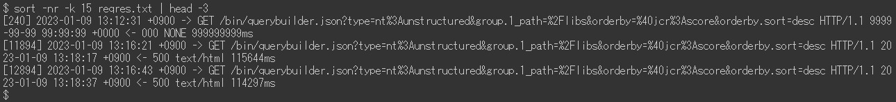
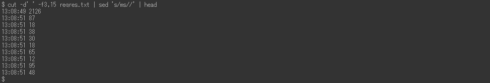

# Adobe Experience Manager:request.log分析示例

## 描述 {#description}

AEM request.log包含用于分析性能问题的各种有用信息，如响应时间。 以下是使用Linux命令（包括一些外部命令）的分析示例列表。

<b>环境</b>
AEM 6.5, Linux(Bash)

## 解决方法 {#resolution}

<b>目录:</b>

简介request.log的格式

准备步骤1. 数据清理步骤2. 重新启动时间步骤3。 每小时访问次数步骤4。 最大并发处理步骤5。 拆分日志文件步骤6。 合并请求记录和响应记录

分析示例1。 访问次数最多的示例2。 访问缺少的响应示例3。 访问速度慢示例4。 响应时间的时间序列数据示例5。 最小、平均（平均）、中值、最大响应时间示例6。 每个时段的访问次数示例7。 每个时段的响应状态数示例8。 最常使用的URL示例9。 request.log记录的access.log记录

结论

<b>简介</b>

<u>request.log的格式</u>

AEM 6.5默认生成以下格式的request.log。 由于系统限制，本文中的命令行显示为图像而不是纯文本。

request.log示例：

在本文中，我将带有“ — ”的行称为“请求记录”。 行“ — ”是“响应记录”。

请求记录当AEM收到请求时，将记录请求记录。 它包含接收日期和时间、请求ID、请求方法和URL。

响应记录当AEM响应请求时，将记录响应记录。 它包含响应日期和时间、请求ID、状态代码、Content-Type和响应时间（以毫秒为单位）。

另请参阅相应的手册：https://experienceleague.adobe.com/docs/experience-manager-65/deploying/configuring/monitoring-and-maintaining.html?lang=en#interpreting-the-request-log

<b>准备</b>

<u>步骤 1. 数据清理</u>

在开始分析request.log之前，必须使日志记录标准化。

第一个sed命令删除响应记录的Content-Type中的额外空格，以防止与空格的字段分离错误。 ruby命令将日期格式转换为ISO 8601。 ruby命令还用空格而不是冒号来分隔日期和时间。

<u>步骤 2. 重新启动时间</u>

重新启动AEM和Service Pack安装会重置request.log的请求ID。 请求ID = 0的请求记录表示可能存在此类操作。

在上例中，请求ID在13时重置为0:08:49和13:26:13.

<u>步骤 3. 每小时访问次数</u>

计算每小时的访问次数和request.log的时间范围。

<u>步骤 4. 最大并发处理数</u>

并发处理数量有助于猜测AEM的服务器负载。

默认情况下，AEM中Jetty的最大并发连接数设置为200。 完成响应后释放套接字存在延迟。 当并发处理数量超过大约170个时，它将无法接受新请求。

<u>步骤 5. 拆分日志文件</u>

当AEM重新启动或安装Service Pack时，将重置request.log的请求ID。 由于此行为，当request.log包含此类操作时，分析可能不正确。 要执行准确的分析并减少一次处理的文件大小，请使用请求ID = 0的请求记录拆分request.log。

<u>步骤 6. 合并请求记录和响应记录</u>

按请求ID合并请求和响应记录，更便于在性能问题开始时发现。 在后面的示例中，我将使用此合并的日志文件。

最后一个sed命令向没有相应响应记录的请求记录添加虚拟响应。 也可能存在没有请求记录的响应记录。 但它们是可忽略的，因为它们通常不是调查的问题。

合并的日志文件应如下所示：

<b>分析示例</b>

<u>示例 1. 访问次数最多</u>

按响应时间（包括未响应的访问）以降序方式对合并的日志文件进行排序。

<u>示例 2. 访问缺少的响应</u>

使用虚拟响应时间提取缺少其相应响应记录的访问。

如果接收访问而不响应的时间与服务器负载的增加相关，则这些访问可能触发性能问题。

<u>示例 3. 访问缓慢</u>

提取用时超过10秒的访问。

当点击量过高时，请将grep命令中的0-9{5}替换为0-9{6}，以缩小到需要超过100秒的访问范围。

<u>示例 4. 响应时间的时间序列数据</u>

仅从数据中提取时间戳和响应时间对于创建图形非常有用。

省略立即响应的访问会提高数据的效率。 以下示例提取用时超过一秒的访问。

<u>示例 5. 最小、平均（平均）、中值、最大响应时间</u>

上例使用datamash命令(https://www.gnu.org/software/datamash/)进行统计处理。 如果日志包含未响应的访问，则虚设值将影响结果。

<u>示例6. 每个时段的访问次数</u>

计算每10分钟的访问次数。 结果有助于确定大流量是否导致性能问题。

以下示例将数据范围缩小为仅POST请求。 典型的用例是确定内容创作或复制到发布层的集中程度。

<u>示例7. 每个时段的响应状态数</u>

使用datamash命令创建每10分钟每个响应状态的数量表。

<u>示例8. 最常使用的URL</u>

打印每10分钟访问频率最高的前三个URL。

<u>示例9. request.log记录的access.log记录</u>

搜索access.log ，查找与特定请求ID对应的记录。

如果同时对同一URL进行了多次访问，则结果会显示单个请求ID的多个access.log记录。

<b>结论</b>

我希望本文中的示例将帮助您分析性能问题。

列出的示例已在CentOS 7.5和Ubuntu 22.04LTS上进行了测试，但它们可能无法按预期工作，具体取决于您的环境，如命令的不同版本或变体。 请根据环境中安装的命令相应地调整它们。

