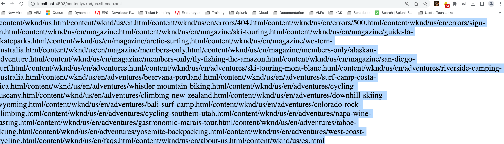

# Sitemap.xml格式不正确

探索修复AdobeAEM Sitemap格式问题的简单步骤。

## 描述 {#description}

### <b>环境</b>

Adobe Experience Manager as a Cloud Service

### <b>问题/症状</b>

根据文档使用现成设置配置站点地图时，其格式不正确（请参阅附加的图像以供参考）。

## 解决方法 {#resolution}

使用本地SDK时：

1. 转到 <b>配置管理器</b> ([https://localhost:4502/system/console/configMgr](http://localhost:4502/system/console/configMgr%29 "关注链接"))和搜索 <b>AdobeAEM SEO — 页面树Sitemap生成器</b> (com.adobe.aem.wcm.seo.impl.sitemap.PageTreeSitemapGeneratorImpl)。

2. 打开 <b>config</b> 和取消选中 <b>添加语言替代项</b>.

   <b>注释 —  </b>如果启用，则页面的语言副本将作为语言替代项添加到URL条目<b> </b>(enableLanguageAlternates)。

3. 保存设置。

4. 重试用例。

使用云环境（非SDK）时，请在Git存储库中设置上述OSGI设置，并通过管道进行部署。
