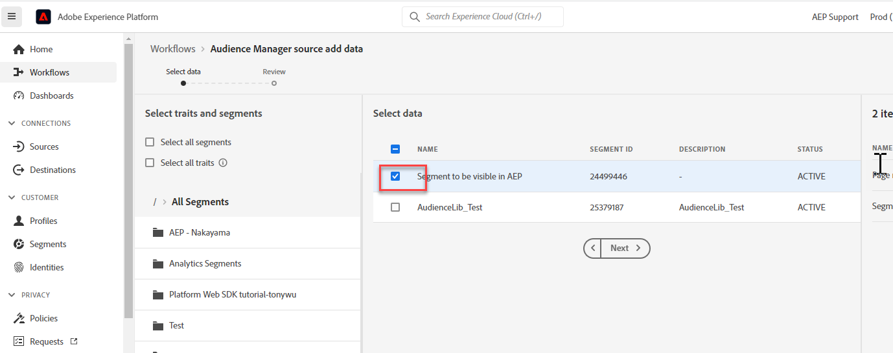

# 错误：由于启用了区段共享，不允许删除

## 描述 {#description}

<b>环境</b>
- Audience Manager
- Experience Platform

<b>问题/症状</b>
尝试删除AAM (Adobe Audience Manager)中的特征或区段时，会发生此错误。 此错误的原因是，因为特征或区段是从Audience Manager共享到AEP (Adobe Experience Platform)的。

以下给定步骤将有助于解决以下错误： *不允许删除，因为启用了区段共享*

## 解决方法 {#resolution}

请按照以下步骤操作： 

1. 导航至 <b>源</b> 选项卡，然后打开Audience Manager源连接器的设置：

   

2. <b>取消选中</b> 您尝试从AAM中删除的区段：

   
3. 取消选中区段或特征后，单击 <b>下一个</b> 在右上角。 在生成的页面上，查看更改并单击 <b>已完成</b>.

如果您要将所有区段和特征从AAM共享到AEP，则需要更新配置以共享特定区段或停止共享数据以删除AAM区段。
