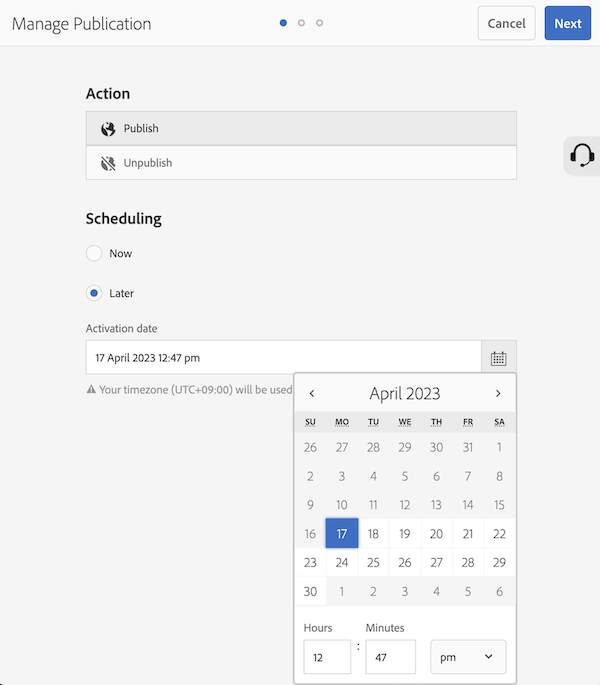

# 如何自定义管理发布激活日期的时间格式？

## 描述 {#description}

<b>环境</b>

Adobe Experience Manager(AEM)6.5

<b>问题/症状</b>

本文介绍了如何自定义管理发布激活日期的时间格式。

## 解决方法 {#resolution}

为目标语言创建i18n字典。 以下步骤可自定义12小时到24小时的英语时间格式。

<b>步骤 1.</b> 使用Moment.js语法(https://momentjs.com/docs/#/i18n/)构建自定义时间格式

24小时格式：“2023/04/11 14:24”›“YYYY/MM/DD HH:mm”

<b>步骤 2.</b> 使用CRXDE Lite创建字典数据

- 在您的项目下创建一个i18n文件夹(/apps/wknd/i18n)
- 在i18n文件夹(/apps/wknd/i18n/en.json)下创建文件en.json
- 将以下属性添加到文件节点：
   - Name = jcr:mixinTypes， Type = Name`[` `]` ，值= mix:language
   - 名称= jcr:language，类型=字符串，值= en
- 文件内容： `{ "D MMMM YYYY hh:mm a" : "YYYY/MM/DD HH:mm" }`

<b>步骤 3.</b> 访问“管理发布”屏幕以检查更改

由于浏览器缓存，新时间格式可能会在一段时间后反映出来。

