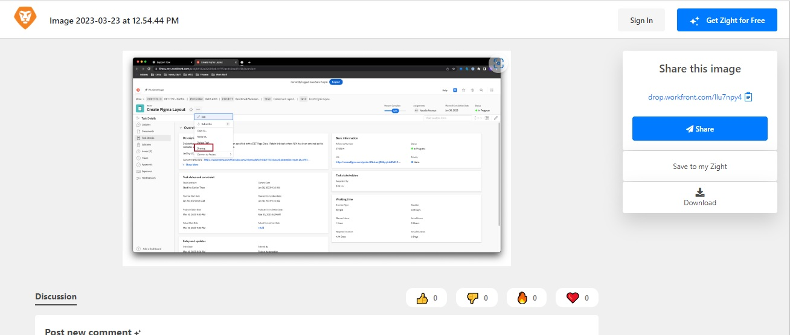
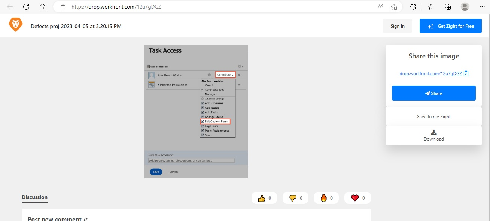

# 无法编辑自定义字段 | Workfront

## 描述 {#description}

<b>环境</b>  Workfront     <b>问题/症状</b>
用户在编辑自定义字段时可能会遇到不同情况。 例如，在提交请求时、在对象上查看自定义表单时，或在报表上查看自定义字段时。

## 解决方法 {#resolution}

<b>要解决的步骤：</b>
1. 确保包含字段的表单已附加到对象，用户尝试编辑
   1. 如果非管理员用户希望将表单附加到对象，则他们将需要管理对该对象的访问权限，才能附加表单。
2. 验证表单共享中的所有详细信息是否正确
   1. 打开 <b>共享</b> 表单所附加到的对象的设置，请参阅下文：
   2. 在 <b>共享</b>菜单
      - 如果用户未列出，请将其添加到共享中
   3. 确保用户具有 <b>Contribute</b> 许可 <b>编辑自定义表单</b> 在 <b>高级设置、 </b>请参阅下文：
   4. <b>（此步骤是可选的） </b>如果此表单是<b> 请求队列、 </b>在<b> 请求队列 </b>自定义表单。 请参阅下文：

有关更多信息，请打开以下链接：

- [编辑自定义表单字段中的信息](https://experienceleague.adobe.com/docs/workfront/using/basics/work-with-custom-forms/edit-custom-forms.html?lang=en)
- [创建请求队列](https://experienceleague.adobe.com/docs/workfront/using/manage-work/requests/create-and-manage-request-queues/create-request-queue.html?lang=en)

