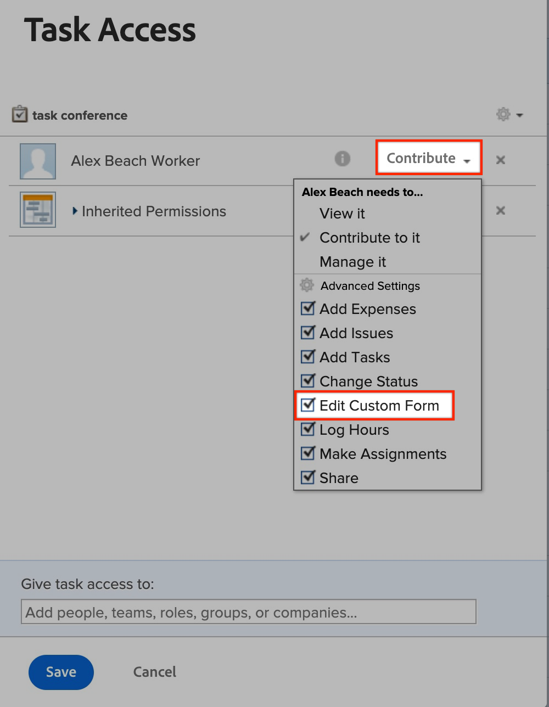

# 无法编辑自定义字段 | Workfront

了解如何在Workfront中编辑自定义字段，请执行以下步骤。

## 描述 {#description}

### <b>环境</b>

Workfront

### <b>问题/症状</b>

在某些情况下，用户可能在编辑自定义字段时遇到问题。 例如，在提交请求时、查看对象上的自定义表单时，或者查看报告上的自定义字段时。

## 解决方法 {#resolution}

<b>要解决的步骤：</b>
1. 确保包含字段的表单已附加到用户尝试编辑的对象。
   1. 如果非管理员用户想要将表单附加到对象，他们将需要管理对对象的访问权限才能附加表单。
2. 验证表单共享中的所有详细信息是否正确。
   1. 打开 <b>共享</b> 表单附加到的对象的设置。 请参阅下文：
   2. 在页面上查找受影响的用户 <b>共享</b>菜单。
      - 如果未列出该用户，则将其添加到 <b>共享</b> 菜单。
   3. 确保用户具有 <b>Contribute</b> 具有的权限 <b>编辑自定义表单</b> 在中启用 <b>高级设置。 </b>请参阅下文：
   4. <b>（此步骤是可选的） </b>如果此表单属于<b> 请求队列， </b>检查<b> 请求队列 </b>自定义表单也是如此。 请参阅下文：

有关详细信息，请打开以下链接：

- [编辑自定义表单字段中的信息](https://experienceleague.adobe.com/docs/workfront/using/basics/work-with-custom-forms/edit-custom-forms.html?lang=en)
- [创建请求队列](https://experienceleague.adobe.com/docs/workfront/using/manage-work/requests/create-and-manage-request-queues/create-request-queue.html?lang=en)
