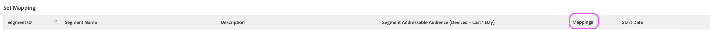

# LiveRamp服务器到服务器目标

本文概述了Adobe Audience Manager中的LiveRamp目标设置。

## 描述 {#description}

<b>环境</b>

Adobe Audience Manager

<b>问题/症状</b>

本文概述了Audience Manager中的LiveRamp目标。

<b>学习目标</b>

- &#x200B;&#x200B; &#x200B;&#x200B; &#x200B; &#x200B;&#x200B;LiveRamp目标设置过程
- 区段激活流程

## 解决方法 {#resolution}

<b>LiveRamp目标设置</b>

如果已经存在LiveRamp目标，请跳至区段激活部分。 

LiveRamp目标是 [服务器到服务器集成](https://experienceleague.adobe.com/docs/audience-manager/user-guide/features/destinations/device-based/device-based-destinations-list.html?lang=en)，这意味着配置发生在后端。 首次进行目标设置时，您将需要Audience Manager用户关怀团队的帮助。 请通过以下方式打开案例 [Admin Console](https://adminconsole.adobe.com/) 请求创建LiveRamp目标。 请务必包含这些关键详细信息：

- 目标名称和描述
- LiveRamp客户端名称（由LR代表提供的字母数字值）
- 区段映射首选项：手动与自动填充ID

区段映射选项将影响传递到LiveRamp平台的方法。 请继续阅读区段激活部分，了解更多详细信息。

<b>区段激活流程</b>

一旦用户关怀团队创建目标，可以直接从UI将特定受众/区段激活到LiveRamp目标。 首先，您必须导航到目标，然后选择编辑：

现在，从该屏幕中标识并添加要映射的区段：

映射值指示LiveRamp如何表示其平台中的受众： 

如果用户选择使用自动填充（默认选项）配置目标，则区段ID将自动填充到映射字段中。 这意味着所有区段都将在LiveRamp平台中按ID进行组织。

如果用户选择手动映射区段，则可以在设置映射值时为区段选择自己的友好名称或ID。 其缺点是每次映射区段时都需要手动输入这些值。 这就是默认和首选方法涉及自动映射区段ID的原因。 如果您对此流程有任何疑问，请通过Audience Manager用户关怀部门打开案例，以便我们提供进一步帮助。
