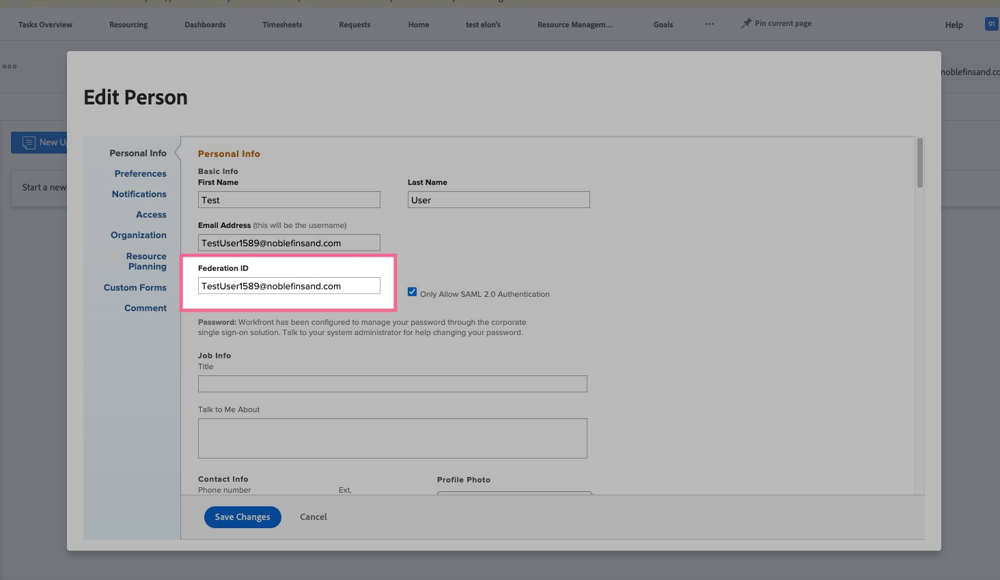

# 登录错误，因为用户未映射SSO（单点登录）

要解决登录错误，请检查Workfront帐户中列出的联合ID，并使用审核日志作为疑难解答工具。

## 描述 {#description}

### 环境

Workfront

### 问题/症状

在尝试使用单点登录(SSO)通过Workfront登录时，页面将被重定向到Workfront登录页面。 在登录页面的网址栏上，看到一条错误消息，显示“用户未映射”。

## 解决方法 {#resolution}

1. 导航到Workfront中收到此错误的特定用户：
   - [编辑用户](https://experienceleague.adobe.com/docs/workfront/using/administration-and-setup/add-users/create-manage-users/edit-a-users-profile.html?lang=en).
   - 如果没有用户帐户， [创建新用户](https://experienceleague.adobe.com/docs/workfront/using/administration-and-setup/add-users/create-manage-users/add-users.html?lang=en) 帐户。
2. 验证用户是否列出了联合ID：
   - 检查联盟标识。
3. 如果Federation ID为空，请执行以下步骤：
   - 输入由您的身份提供程序提供的用户的联合ID（区分大小写）。
   - 单击 <b>保存。</b>
   - 注意：联合ID区分大小写，并且必须与从身份提供程序发送到Workfront的方式完全匹配。 如果您不确定Federation ID或其区分大小写，请咨询您的网络或IT管理员。
   - 此外，检查联合ID之前或之后的任何额外空格，因为它们可能是导致此错误的原因。

可选步骤：审核日志

将Workfront中的审核日志用作故障排除工具，以检查在登录尝试失败期间作为联合ID（名称ID）传递的身份提供方是什么。

1. 单击 <b>设置</b>
2. 转到系统 `>`  [审核日志](https://experienceleague.adobe.com/docs/workfront/using/administration-and-setup/add-users/create-manage-users/audit-logs.html?lang=en)
3. 应用过滤器以显示失败的登录尝试
   - 向下筛选到失败的登录尝试 
   - 单击 <b>应用</b>.
4. 从身份提供程序传递到Workfront的联合ID（名称ID）显示在最近失败的登录尝试的详细信息列中。
   - 确保详细信息列中所示的此Federation ID与Workfront上输入的作为Federation ID的完全匹配（区分大小写）。
