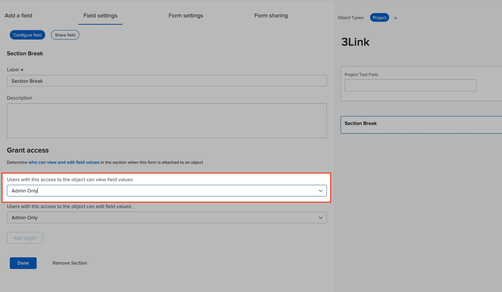
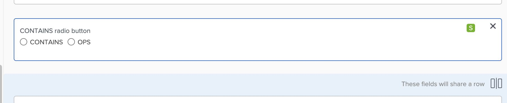

# 自定义字段未显示在表单上

要解决自定义字段未显示的问题，请检查该字段是否位于正确的表单上以及跳过逻辑配置。

## 描述 {#description}

### <b>环境</b>

Workfront

### <b>问题/症状</b>

字段已添加到自定义表单，但是，当您查看表单时，该字段不可见。

## 解决方法 {#resolution}

要解决此问题，请执行以下步骤：

1. 确保字段的格式正确。
2. 检查分节符。

   - 如果有分节符，请检查查看分节中的字段所需的访问权限。                     
3. 检查表单中的“跳过逻辑”。                                                                                                                                               
   - 实施跳过逻辑时，其他部分正在等待启动可以隐藏这些部分/其他字段的跳过逻辑。
   - 字段上将显示“S”符号，表示字段具有跳过逻辑。
   - 如果跳过逻辑隐藏了字段，则用户将需要填写要触发逻辑的必填字段，否则您可能需要重新配置表单上的逻辑。

<b>相关读数：</b>

- [使用旧版表单生成器向自定义表单添加显示逻辑和跳过逻辑](https://experienceleague.adobe.com/docs/workfront/using/administration-and-setup/customize/custom-forms/custom-form-builder/use-the-custom-form-builder/display-or-skip-logic-custom-form.html)
- [使用旧版表单生成器向自定义表单添加分区界限](https://experienceleague.adobe.com/docs/workfront/using/administration-and-setup/customize/custom-forms/custom-form-builder/use-the-custom-form-builder/add-a-section-break-to-a-custom-form.htm)

