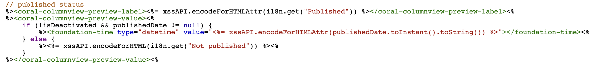

# 在站点控制台上自定义页面发布日期的显示格式

在Adobe Experience Manager Sites中，页面的发布日期显示在站点控制台中，不含每日时间。 本文提供了有关如何自定义页面发布日期的日期/时间格式以包含一天中的时间的说明。

## 描述 {#description}

### 环境

- Adobe Experience Manager v6.5
- Adobe Experience Manager as a Cloud Service

### 问题/症状

站点控制台中将显示页面的发布日期，而不显示当日时间。

## 解决方法 {#resolution}

为每个列视图和列表视图创建一个叠加。

<b>A.用于列视图</b>

`/libs/cq/gui/components/coral/admin/page/columnpreview/columnpreview.jsp` 被覆盖了。

<u>早于</u>：

<u>之后</u>：

添加 `type="datetime"` 归因于 `foundation-time` 标记之前。

<b>B.对于列表查看</b>

`/libs/cq/gui/components/coral/admin/page/row/row.jsp` 被覆盖了。

<u>早于</u>：

<u>之后</u>：

添加 `type="datetime"` 归因于 `foundation-time` 标记之前。

