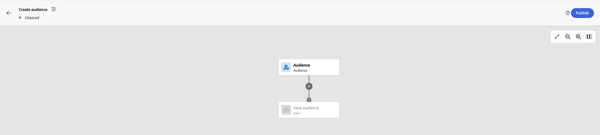

# AEP — 组合受众是只读的 — 我们需要哪些权限？

访问“受众”部分以构成新受众时，创建过程会显示一个只读标记。 需要什么权限才能删除该标记？

## 描述 {#description}

在访问“受众”部分以构成新受众时，创建过程会显示一个只读标记，如下所示：

## 解决方法 {#resolution}

要删除只读标记，请确保AEP中的“配置文件管理”权限包含“<b>管理合并策略</b>&#39;特权 — 这将导致标记消失：

