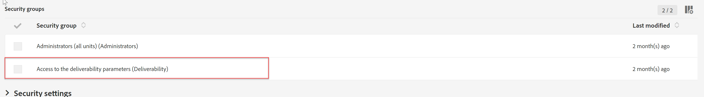

# 无法在ACS中编辑品牌策略配置

本文为Campaign Standard问题提供了一个解决方案，在该问题中，您无法在ACS中编辑品牌策略配置。 您可能需要检查您是否分配到了 <b>访问可投放性参数</b> 安全组，如果您没有安全组，则进行分配。

## 描述 {#description}

### 环境

Adobe Campaign Standard

### 问题/症状

您无法在Adobe Campaign Standard中编辑品牌策略配置。

## 解决方法 {#resolution}

要编辑品牌配置，请访问 <b>管理员</b> 安全组不足

检查您在路径下的实例的访问权限： <b>管理 </b>`>`  <b>用户</b> 和 <b>安全性 </b>`>`  <b>用户</b>. 在安全组下，确保您被分配到 <b>访问可投放性参数</b> 安全组。

将您分配到此组后，您应该能够编辑品牌配置。
